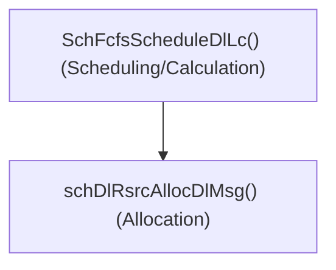
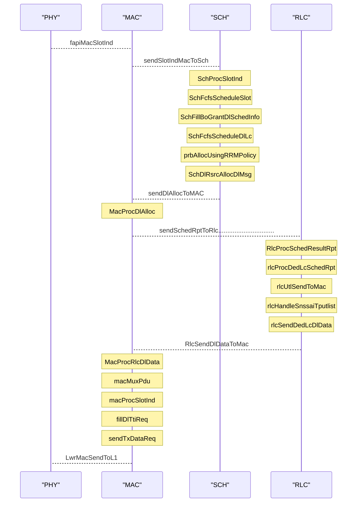

# 2024/05/07 Study Note (Check if OSC Scheduler Do Scheduling (Calculation) and PRB Allocation Combined or Separately)

###### tags: `2024`


**Goal:**
- [x] [Check if OSC Scheduler Do Scheduling (Calculation) and PRB Allocation Combined or Separately](#0-Summary)
 
**References:**
- [2024/04/30 Study Note (OSC O-DU High I-release FCFS Multi UE scheduler Starvation Example Use Case)](https://github.com/bmw-ece-ntust/guideline-template/blob/wilfridAzariah/studyNotes/20240430%20Study%20Note%20(OSC%20O-DU%20High%20I-release%20FCFS%20Multi%20UE%20scheduler%20Starvation%20Example%20Use%20Case).md)
- [5G FAPI: PHY API Specification](https://www.smallcellforum.org/reports/5g-fapi-phy-api-specification/#:~:text=PHY%20FAPI%20is%20the%20main,MAC%20and%20higher%20layer%20protocols.)

**Outline:**
- [2024/05/07 Study Note (Check if OSC Scheduler Do Scheduling (Calculation) and PRB Allocation Combined or Separately)](#2024-05-07-study-note--check-if-osc-scheduler-do-scheduling--calculation--and-prb-allocation-combined-or-separately-)
          + [tags: `2024`](#tags---2024-)
  * [0. Summary](#0-summary)
  * [1. Overall Flow](#1-overall-flow)
  * [2. A Little Background in 5G FAPI: PHY API Specification](#2-a-little-background-in-5g-fapi--phy-api-specification)
  * [3. OSC's Scheduler PRB Scheduling/Calculation](#3-osc-s-scheduler-prb-scheduling-calculation)
  * [4. OSC's Scheduler PRB Allocation based on 1 DCI](#4-osc-s-scheduler-prb-allocation-based-on-1-dci)
  * [5. The separation of PRB Scheduling/Calculation and Allocation](#5-the-separation-of-prb-scheduling-calculation-and-allocation)
  * [6. What about between LCs inside UE?](#6-what-about-between-lcs-inside-ue-)

<small><i><a href='http://ecotrust-canada.github.io/markdown-toc/'>Table of contents generated with markdown-toc</a></i></small>


## 0. Summary

1. OSC Scheduler Do Scheduling (Calculation) and PRB Allocation Combined or Separately?
    - Separately, [details](#5-The-separation-of-PRB-SchedulingCalculation-and-Allocation)

2. Which function do the Scheduling (Calculation) and PRB Allocation?
    - `SchFcfsScheduleDlLc()` do Scheduling/Calculation
    - `schDlRsrcAllocDlMsg()` do the Allocation



3. How does the Scheduling (Calculation) and PRB Allocation work?
    - First, calculate the total amount of PRB needed for 1 UE (including all LC of 1 UE)
    - Then, allocate PRB using start PRB and amount of PRB


4. Number 3 only explain PRB allocation for each UE. How about each LC?
    - Each LC does not have specific start PRB & amount of PRB. All LCs' PDU of 1 UE will be multiplex into a single PDU. This PDU will then be PRB allocated using start PRB and amount of PRB. [Details](#6-What-about-between-LCs-inside-UE)


## 1. Overall Flow



## 2. A Little Background in 5G FAPI: PHY API Specification

- PDSCH carries user data

- PDSCH PDU has specific information to be included:
    - rnti = The RNTI used for identifying the UE when receiving the PDU
    - etc

- PDCCH carries the control infromation of PDSCH

- PDCCH carries multiple Downlink control information (DCI)

- DL DCI PDU has specific information to be included:
    - rnti = The RNTI used for identifying the UE when receiving the PDU
    - etc

- From here, we can deduce that the amount of DCI in a PDCCH PDU depends on the amount of UE in a slot

## 3. OSC's Scheduler PRB Scheduling/Calculation

- For a single UE per SLOT, PRB scheduling/Calculation is done in function `SchFcfsScheduleDlLc()`

- Full code can be seen in `l2/src/5gnrsch/sch_fcfs.c`

- Here is a snippet of how the code works:
    1. Divide LC of each UE to dedicatedList and defaultList
    ```c=1011
    /*Check the LC is Dedicated or default and accordingly LCList will
    * be used*/
    if(ueCb->dlInfo.dlLcCtxt[lcIdx].isDedicated)
    {
        lcLL = &(fcfsHqProcCb->lcCb.dedLcList);
        rsvdDedicatedPRB = ueCb->dlInfo.dlLcCtxt[lcIdx].rsvdDedicatedPRB;
    }
    else
    {
        lcLL = &(fcfsHqProcCb->lcCb.defLcList);
    }
    ```
    2. Search how many PRB are free and the start number of the free PRB
    ```c=1055
    /*[Step3]: Calculate Best FREE BLOCK with MAX PRB count*/
    maxFreePRB = searchLargestFreeBlock((*hqP)->hqEnt->cell, pdschTime, startPrb, DIR_DL);
    ```
    3. Allocate (Calculate) PRB for LC dedicatedList and defaultList
    ```c=
    /*PRB Alloc for Dedicated LCs*/
    prbAllocUsingRRMPolicy(&(fcfsHqProcCb->lcCb.dedLcList), TRUE, mcsIdx, pdschNumSymbols,\
        &(fcfsHqProcCb->lcCb.sharedNumPrb), &(rsvdDedicatedPRB), &isTxPayloadLenAdded, NULLP);

    /*PRB Alloc for Default LCs*/
    prbAllocUsingRRMPolicy(&(fcfsHqProcCb->lcCb.defLcList), FALSE, mcsIdx, pdschNumSymbols, \
        &(fcfsHqProcCb->lcCb.sharedNumPrb), &(rsvdDedicatedPRB), &isTxPayloadLenAdded, NULLP);
    ```
    4. `SchFcfsScheduleDlLc()` will return the number of BO allocated for the UE (total of all LC of the UE)
    ```c=1124
    return accumalatedSize;
    ```
    5. You have to note that `SchFcfsScheduleDlLc()` also returns the start PRB of each UE

## 4. OSC's Scheduler PRB Allocation based on 1 DCI

- For a single UE per SLOT, PRB Allocation is done in function `schDlRsrcAllocDlMsg()`

- Full code can be seen in `l2/src/5gnrsch/sch_common.c`

- Here is a snippet of how the code works:
    1. Search the coreSet of the pdcch
    ```c=884
    for(cRSetIdx = 0; cRSetIdx < ueCb.ueCfg.spCellCfg.servCellRecfg.initDlBwp.pdcchCfg.numCRsetToAddMod; cRSetIdx++)
    {
        if(ueCb.ueCfg.spCellCfg.servCellRecfg.initDlBwp.pdcchCfg.cRSetToAddModList[cRSetIdx].cRSetId\
            == pdcchAllocInfo.cRSetId)
        {
            coreset1 = ueCb.ueCfg.spCellCfg.servCellRecfg.initDlBwp.pdcchCfg.cRSetToAddModList[cRSetIdx];
            break;
        }
    }
    ```
    2. Search the searchSPace of the pdcch
    ```c=
    for(ssIdx = 0; ssIdx < ueCb.ueCfg.spCellCfg.servCellRecfg.initDlBwp.pdcchCfg.numSearchSpcToAddMod; ssIdx++)
    {
        if(ueCb.ueCfg.spCellCfg.servCellRecfg.initDlBwp.pdcchCfg.searchSpcToAddModList[ssIdx].searchSpaceId\
            ==  pdcchAllocInfo.ssId)
        {
            searchSpace = ueCb.ueCfg.spCellCfg.servCellRecfg.initDlBwp.pdcchCfg.searchSpcToAddModList[ssIdx];
            break;
        }
    }
    ```
    3. fill BWP information
    4. Fill PDCCH PDU
    5. While filling PDCCH PDU, 1 DCI is associated with 1 UE
    ```c=946
    pdcch->dci[pdcch->numDlDci].rnti = ueCb.crnti;
    ```
    6. For each DCI/UE, PDSCH PDU is filled
    7. While filling PDSCH PDU, 1 PDSCH is associated with 1 UE
    ```c=967
    pdsch->rnti = ueCb.crnti;
    ```
    8. Each PDSCH will have the startPRB and numPRB assigned. These numbers are based on the return of `SchFcfsScheduleDlLc()` mentioned before
    ```c=1004
    pdsch->pdschFreqAlloc.startPrb = startPRB; /*Start PRB will be already known*/
    pdsch->pdschFreqAlloc.numPrb = schCalcNumPrb(tbSize, ueCb.ueCfg.dlModInfo.mcsIndex, pdschNumSymbols);
    ```
## 5. The separation of PRB Scheduling/Calculation and Allocation

- Based on [3](#3-OSCs-Scheduler-PRB-SchedulingCalculation) and [4](#4-OSCs-Scheduler-PRB-Allocation-based-on-1-DCI), we can conclude that:

```flow
op1=>operation: SchFcfsScheduleDlLc() (Scheduling/Calculation)
op2=>operation: schDlRsrcAllocDlMsg() (Allocation)

op1->op2
```

1. OSC will do PRB Scheduling/Calculation first. This is done per UE, per LC. But the total number PRB of LCs will be summed into number of PRB per UE.
2. After that, OSC will allocate PRB. Allocation of PRB will be done in UE sequence. Adjacent PRB will always belong to the same UE.

## 6. What about between LCs inside UE?

- PDSCH PDU does not specify the start and number of PRB per LC of each UE

- MAC will multiplex the PDU of each LC of 1 UE to form 1 aggregated PDU

- This function is done in `macMuxPdu()` in `l2/src/5gnrmac/mac_mux.c`

- In `macMuxPdu()`, we can see that bytePos is incremented per lcid
```c=316
/* PACK ALL MAC SDUs */
for(pduIdx = 0; pduIdx < dlData->numPdu; pduIdx++)
{
    lcid = dlData->pduInfo[pduIdx].lcId;
    switch(lcid)
        {
        case MAC_LCID_CCCH:
        case MAC_LCID_MIN ... MAC_LCID_MAX :
            {
                lenField = dlData->pduInfo[pduIdx].pduLen;
                if(dlData->pduInfo[pduIdx].pduLen > 255)
                {
                    FBit = 1;
                    lenFieldSize = 16;

                }
                else
                {
                    FBit = 0;
                    lenFieldSize = 8;
                }
                /* Packing fields into MAC PDU R/F/LCID/L */
                packBytes(macPdu, &bytePos, &bitPos, RBit, RBitSize);
                packBytes(macPdu, &bytePos, &bitPos, FBit, FBitSize);
                packBytes(macPdu, &bytePos, &bitPos, lcid, lcidSize);
                packBytes(macPdu, &bytePos, &bitPos, lenField, lenFieldSize);
                memcpy(&macPdu[bytePos], dlData->pduInfo[pduIdx].dlPdu, lenField);
                bytePos += lenField;
                break;
            }

    default:
        DU_LOG("\nERROR  -->  MAC: Invalid LCID %d in mac pdu",lcid);
        break;
    }
}
```


- Since this loop will go through each LC 1-by-1, we can say that Adjacent PRB will always belong to the same LC.


