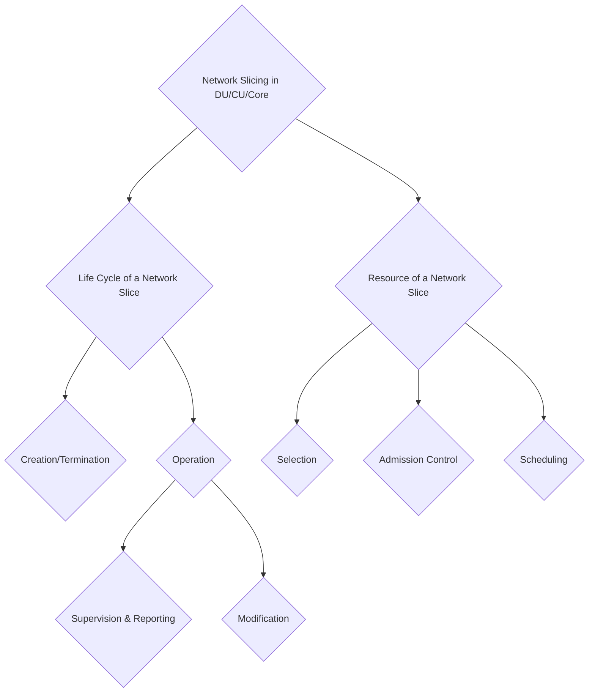

# 2024/08/15 Study Note (RAN Slicing Architecture Requirements)

###### tags: `2024`

**Goal:**
- [x] Define system architecture Requirements for RAN Slicing
    - [x] [What parameters need to get from Core?](#2-What-parameters-need-to-get-from-Core)
    - [x] [What parameters need to be available in CU?](#3-What-parameters-need-to-get-from-CU)
    - [x] [What function need to be available in CU?](#4-What-function-need-to-be-available-in-CU)
    - [x] [What parameters need to be available in DU?](#5-What-parameters-need-to-get-from-DU)
    - [x] [What function need to be available in DU?](#6-What-function-need-to-be-available-in-DU)
    - ~~[ ] What parameters need to be available in PHY to UE?~~ -> Already covered in other parts
 
**References:**
- 3GPP TS 123 501 System Architecture for 5G System
- O-RAN WG1 Study on O-RAN Slicing
- 3GPP TS 138 300 NR & NG-RAN Overall Description
- 3GPP TS 138 401 NG-RAN Architecture Description
- 3GPP TS 138 413 NGAP
- 3GPP TS 138 460 E1
- 3GPP TS 138 470 F1

## Table of Contents
- [2024/08/15 Study Note (RAN Slicing Architecture Requirements)](#2024-08-15-study-note--ran-slicing-architecture-requirements-)
          + [tags: `2024`](#tags---2024-)
  * [Table of Contents](#table-of-contents)
  * [0. Summary](#0-summary)
  * [1. What functions need to be available in Core](#1-what-functions-need-to-be-available-in-core)
  * [2. What parameters need to get from Core](#2-what-parameters-need-to-get-from-core)
  * [3. What parameters need to get from CU](#3-what-parameters-need-to-get-from-cu)
  * [4. What function need to be available in CU](#4-what-function-need-to-be-available-in-cu)
  * [5. What parameters need to get from DU](#5-what-parameters-need-to-get-from-du)
  * [6. What function need to be available in DU](#6-what-function-need-to-be-available-in-du)

<small><i><a href='http://ecotrust-canada.github.io/markdown-toc/'>Table of contents generated with markdown-toc</a></i></small>

## 0. Summary

**Network Slice identifier**
**S-NSSAI** is a unique identifier for each network slice. NSSAI (Network Slice Selection Assistance Information) includes one or a list of s-NSSAIs which is a combination of mandatary SST (Slice/Service Type) and an optional SD (Slice Differentiator).

 Life Cycle of a Network Slice Details

## 1. What functions need to be available in Core

1. (3GPP TS 23.501) **network slice selection function**:
    - Selecting the set of Network Slice instances serving the UE

2. (3GPP TS 23.501) **network slice admission control function**:
    - monitors and controls the number of registered UEs per network slice and/or the number of PDU Sessions per network slice

## 2. What parameters need to get from Core

1. **Requested NSSAI**:
    - Description: When UE was about to Register to a Network, UE will request a list of network slice it want to connect to
    - Contains in: Registration Request; in Initial UE Message

2. **Allowed NSSAI, Rejected NSSAI & Configured NSSAI**:
    - Description: Core Network will tell the UE which NSSAI it is allowed to connect to
    - Contains in: Registration Accept; in Initial Context Setup Request

3. **Selected sNSSAI / per PDU Session**:
    - Description: When UE was about to Establish a PDU Session to a CN, UE will select the network slice it want to choose for this PDU Session
    - Contains in: PDU Session Establishment Request & Accept

4. **PDU Session sNSSAI**:
    - Description: When UE was about to Establish a PDU Session to a CN, CN will request the RAN to setup resource for the slice that UE requested for this PDU Session
    - Contains in: PDU Session Resource Setup Request & Response

More detail about each message can be accessed from this [note](https://github.com/bmw-ece-ntust/guideline-template/blob/wilfridAzariah/studyNotes/20240813%20Study%20Note%20(What%20parameters%20need%20to%20get%20from%20Core).md)

## 3. What parameters need to get from CU

1. **PDU Session sNSSAI**:
    - Description: When UE was about to Establish a PDU Session to a CN, CN will request the RAN to setup resource for the slice that UE requested for this PDU Session. CU's job is to setup the DRB for this PDU session
    - Contains in: PDU Session Resource Setup Request & Response

## 4. What function need to be available in CU

1. **Admission Control** in CU:
    - (3GPP TS 38.413) Upon reception of the PDU SESSION RESOURCE SETUP REQUEST message, if resources are available for the requested configuration, the NG-RAN node shall execute the requested NG-RAN configuration and allocate associated resources over NG and over Uu for each PDU session listed in the PDU Session Resource Setup Request List IE
    - (3GPP TS 38.460) The establishment of the E1 bearer context is initiated by the gNB-CU-CP and accepted or rejected by the gNB-CU-UP based on admission control criteria (e.g., resource not available). 

2. **Network Slice Selection** in CU:
    - (3GPP TS 38.463) If the Slice Support List IE is contained in the GNB-CU-UP E1 SETUP REQUEST message, the gNB-CU-CP shall store the corresponding information and it may take it into account for bearer context establishment. 

## 5. What parameters need to get from DU

1. **DRB sNSSAI**:
    - Description: When UE was about to Establish a PDU Session to a CN, CN will request the RAN to setup resource for the slice that UE requested for this PDU Session. DU's job is to setup the DRB for this PDU session
    - Contains in: DRB To Be Setup List & DRB Setup List; in UE Context Setup Request & Response; in PDU Session Resource Setup Request & Response

More detail about each message can be accessed from this [note](https://hackmd.io/@superwilfrid/H11zB5O9A)

## 6. What function need to be available in DU

1. **Admission Control** in DU:
    - (3GPP TS 38.470) The establishment of the F1 UE context is initiated by the gNB-CU and accepted or rejected by the gNB-DU based on admission control criteria (e.g., resource not available).

2. **Scheduling** in DU:
    - (O-RAN WG1 Study on O-RAN Slicing) MAC layer needs to allocate PRBs according to the RRM strategies provided by the Operator and slice management entities

