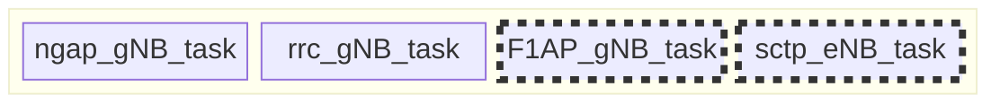
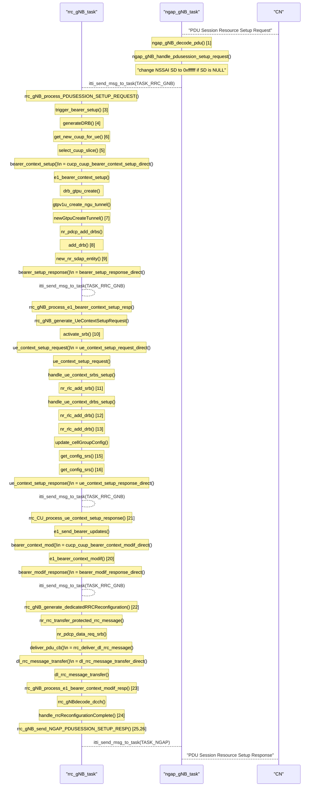

# 2024/09/10 Study Note (Define Current OAI CU Functions & Parameters for RAN Slicing)

###### tags: `2024`


**Goal:**
- [x] [Define Current OAI CU Functions & Parameters for RAN Slicing](#0-Summary)

**References:**
- [openinterface5G Gitlab](https://gitlab.eurecom.fr/oai/openairinterface5g)
- [OAI Feature Set](https://gitlab.eurecom.fr/oai/openairinterface5g/-/blob/develop/doc/FEATURE_SET.md)
- [RAN Slicing Architecture Requirements](https://github.com/bmw-ece-ntust/guideline-template/blob/wilfridAzariah/studyNotes/20240815%20Study%20Note%20(RAN%20Slicing%20Architecture%20Requirements).md)
- [Analyze what are the available in OSC and OAI for RAN slicing](https://github.com/bmw-ece-ntust/guideline-template/blob/wilfridAzariah/studyNotes/20240820%20Study%20Note%20(Analyze%20what%20are%20the%20available%20in%20OSC%20and%20OAI%20for%20RAN%20slicing).md)

**Contents:**
- [2024/09/10 Study Note (Define Current OAI CU Functions & Parameters for RAN Slicing)](#2024-09-10-study-note--define-current-oai-cu-functions---parameters-for-ran-slicing-)
          + [tags: `2024`](#tags---2024-)
  * [0. Summary](#0-summary)
    + [0.1. OAI CU's Task](#01-oai-cu-s-task)
  * [1. PDU Session Setup Request (gNB)](#1-pdu-session-setup-request-gnb)
  * [2. PDU Session Setup Request (CU)](#2-pdu-session-setup-request-cu)
  * [3. Initial Context Setup Request (gNB)](#3-initial-context-setup-request-gnb)
  * [4. Initial Context Setup Request (CU)](#4-initial-context-setup-request-cu)
  * [5. Initial Context Setup Response (gNB)](#5-initial-context-setup-response-gnb)
  * [6. Initial Context Setup Response (CU)](#6-initial-context-setup-response-cu)
  * [7. Slice Configuration (gNB/CU)](#7-slice-configuration-gnbcu)
  * [8. Supported Slice Report to CN (CU)](#8-supported-slice-report-to-cn-cu)
  * [9. E2SM-KPM](#9-e2sm-kpm)

<small><i><a href='http://ecotrust-canada.github.io/markdown-toc/'>Table of contents generated with markdown-toc</a></i></small>

## 0. Summary


1. [CU's slice configuration](#8-Supported-Slice-Report-to-CN-CU) from configuration file is stored in database:
    - If we don't have CP-UP split, all DRB will be to the same executable
    - If we have CP-UP split with single CUUP, all DRB will be to the same CUUP
    - If we have CP-UP split with multi CUUP, each CUUP will have different DRB for different slice

2. CU's slice configuration is reported to CN in [NG Setup request](#8-Supported-Slice-Report-to-CN-CU)

3. [Initial Context Setup Request](#4-Initial-Context-Setup-Request-CU) does not care about slice

4. [PDU Session Setup Request](#2-PDU-Session-Setup-Request-CU) care about slice:
    - CU will choose the CUUP based on the slice supported by the CUUP
    - CU will create DRB in CUUP that is requested in PDU Session Setup

5. [E2SM-KPM](#9-E2SM-KPM) will report UE measurements based on Slice Criteria Input

### 0.1. OAI CU's Task


Dotted box only exist in CU-DU Split




## 1. PDU Session Setup Request (gNB)



 Example Log
```shell=
[NGAP]   PDUSESSIONSetup initiating message
[NR_RRC]   [gNB 0] gNB_ue_ngap_id 1 
[NR_RRC]   Adding pdusession 1, total nb of sessions 1
[NR_RRC]   UE 1: configure DRB ID 1 for PDU session ID 1
[RRC]   selecting CU-UP ID 3584 based on exact NSSAI match (1:0xffffff)
[RRC]   UE 1 associating to CU-UP assoc_id -1 out of 1 CU-UPs
[GTPU]   [100] Created tunnel for UE ID 1, teid for incoming: 602a12d6, teid for outgoing 3 to remote IPv4: 192.168.70.134, IPv6 ::
[PDCP]   added drb 1 to UE ID 1
[SDAP]   Default DRB for the created SDAP entity: 1 
[RRC]   activate SRB 2 of UE 1
[RLC]   Added srb 2 to UE with RNTI 0x7e3d
[RLC]   /home/njain/ios-mcn/openairinterface5g/openair2/LAYER2/nr_rlc/nr_rlc_oai_api.c:868:add_drb_am: added drb 1 to UE with RNTI 0x7e3d
[RLC]   /home/njain/ios-mcn/openairinterface5g/openair2/LAYER2/nr_rlc/nr_rlc_oai_api.c:nr_rlc_add_drb:938: added DRB to UE with RNTI 0x7e3d
[NR_MAC]   UE 7e3d: received capabilities, updating CellGroupConfig
[NR_RRC]   SRS configured with 1 ports
[NR_RRC]   SRS configured with 1 ports
[NR_MAC]   Number of DRBs = 1 and SRBs = 1
[NR_MAC]   number of QOS flows mapped to DRB_id 1: 1
[NR_MAC]   Setting NSSAI sst: 1, sd: 16777215 for DRB: 1
[E1AP]   UE 1: updating PDU session ID 1 (1 bearers)
[RRC]   UE 7e3d replacing existing CellGroupConfig with new one received from DU
[NR_RRC]   UE 1: Generate RRCReconfiguration (bytes 666, xid 0)
[RRC]   UE 1: PDU session ID 1 modified 1 bearers
[NR_RRC]   UE 1: Receive RRC Reconfiguration Complete message (xid 0)
[NR_RRC]   msg index 0, pdu_sessions index 0, status 2, xid 0): nb_of_pdusessions 1,  pdusession_id 1, teid: 1613370070 
 [NR_RRC]   NGAP_PDUSESSION_SETUP_RESP: sending the message
[NGAP]   pdusession_setup_resp_p: pdusession ID 1, gnb_addr 192.168.70.129, SIZE 4, TEID 1613370070
```


## 2. PDU Session Setup Request (CU)


- `select_cuup_slice()` will select which CU-UP is each PDU Session belong to. These are some important consideration to be made:
    - 1 PDU Session will belong only to 1 Slice
    - Each CU-UP can support single slice or multiple slice
    - Each CU can support single CU-UP or multiple CU-UP


```plantuml
participant "sctp_eNB_task" as sctp
participant "F1AP_CU_task" as f1ap
participant "rrc_gNB_task" as rrc
participant "ngap_gNB_task" as ngap
participant "CN" as cn

cn-->ngap: "PDU Session Resource Setup Request"
note over ngap:ngap_gNB_decode_pdu()
note over ngap:ngap_gNB_handle_pdusession_setup_request()
note over ngap:"change NSSAI SD to 0xffffff if SD is NULL"
ngap-->rrc: itti_send_msg_to_task(TASK_RRC_GNB)
note over rrc:rrc_gNB_process_PDUSESSION_SETUP_REQUEST()
note over rrc:trigger_bearer_setup()
note over rrc:generateDRB()
note over rrc:get_new_cuup_for_ue()
note over rrc:select_cuup_slice()
note over rrc: bearer_context_setup()\n = cucp_cuup_bearer_context_setup_direct()
note over rrc: e1_bearer_context_setup()
note over rrc: drb_gtpu_create()
note over rrc: gtpv1u_create_ngu_tunnel()
note over rrc: newGtpuCreateTunnel()
note over rrc: nr_pdcp_add_drbs()
note over rrc: add_drb()
note over rrc: new_nr_sdap_entity()
note over rrc: bearer_setup_response()\n = bearer_setup_response_direct()
rrc-->rrc: itti_send_msg_to_task(TASK_RRC_GNB)
note over rrc:rrc_gNB_process_e1_bearer_context_setup_resp()
note over rrc:rrc_gNB_generate_UeContextSetupRequest()
note over rrc:activate_srb()
note over rrc:ue_context_setup_request()\n = ue_context_setup_request_f1ap()
rrc-->f1ap: itti_send_msg_to_task(TASK_CU_F1)
note over f1ap:CU_send_UE_CONTEXT_SETUP_REQUEST()
note over f1ap:f1ap_itti_send_sctp_data_req()
f1ap-->sctp: itti_send_msg_to_task(TASK_SCTP)
note over sctp:sctp_send_data()
note over sctp:...
sctp-->f1ap
note over f1ap:cu_task_handle_sctp_data_ind()
note over f1ap:f1ap_handle_message()
note over f1ap:f1ap_messages_processing()\n =CU_handle_UE_CONTEXT_SETUP_RESPONSE()
f1ap-->rrc: itti_send_msg_to_task(TASK_RRC_GNB)
note over rrc:rrc_CU_process_ue_context_setup_response()
note over rrc:e1_send_bearer_updates()
note over rrc:bearer_context_mod()\n = cucp_cuup_bearer_context_modif_direct()
note over rrc:e1_bearer_context_modif()
note over rrc:bearer_modif_response()\n = bearer_modif_response_direct()
rrc-->rrc: itti_send_msg_to_task(TASK_RRC_GNB)
note over rrc:rrc_gNB_generate_dedicatedRRCReconfiguration()
note over rrc:nr_rrc_transfer_protected_rrc_message()
note over rrc:nr_pdcp_data_req_srb()
note over rrc:deliver_pdu_cb()\n = rrc_deliver_dl_rrc_message()
note over rrc:dl_rrc_message_transfer()\n = dl_rrc_message_transfer_f1ap()
rrc-->f1ap: itti_send_msg_to_task(TASK_CU_F1)
note over rrc:rrc_gNB_process_e1_bearer_context_modif_resp()
note over f1ap:CU_send_DL_RRC_MESSAGE_TRANSFER()
note over f1ap:f1ap_itti_send_sctp_data_req()
f1ap-->sctp: itti_send_msg_to_task(TASK_SCTP)
note over sctp:sctp_send_data()
note over sctp:...
sctp-->f1ap
note over f1ap:cu_task_handle_sctp_data_ind()
note over f1ap:f1ap_handle_message()
note over f1ap:f1ap_messages_processing()\n = CU_handle_UL_RRC_MESSAGE_TRANSFER()
note over f1ap:nr_pdcp_data_ind()
note over f1ap:enqueue_pdcp_data_ind()
f1ap-->rrc
note over rrc:rrc_gNBdecode_dcch()
note over rrc:handle_rrcReconfigurationComplete()
note over rrc:rrc_gNB_send_NGAP_PDUSESSION_SETUP_RESP()
rrc-->ngap: itti_send_msg_to_task(TASK_NGAP)
ngap-->cn: "PDU Session Resource Setup Response"

```

## 3. Initial Context Setup Request (gNB)

```plantuml
participant "rrc_gNB_task" as rrc
participant "ngap_gNB_task" as ngap
participant "CN" as cn

cn-->ngap: "Initial Context Setup Request"
note over ngap:ngap_gNB_handle_initial_context_request() [1,2,3,4]
ngap-->rrc: itti_send_msg_to_task(TASK_RRC_GNB)
note over rrc:rrc_gNB_process_NGAP_CONTEXT_SETUP_REQ()
note over rrc:rrc_gNB_process_security() [5]
note over rrc:process_gNB_security_key() [6]
note over rrc:rrc_gNB_generate_SecurityModeCommand() [7]
note over rrc:nr_rrc_transfer_protected_rrc_message()
note over rrc:nr_pdcp_data_req_srb()
note over rrc:deliver_pdu_cb()\n = rrc_deliver_dl_rrc_message()
note over rrc:dl_rrc_message_transfer()\n = dl_rrc_message_transfer_direct()
```

 Example Log
```shell=
[NGAP]   NGAP_FIND_PROTOCOLIE_BY_ID ie is NULL (searching for ie: 110)
[NGAP]   could not find NGAP_ProtocolIE_ID_id_UEAggregateMaximumBitRate
[NGAP]   NGAP_FIND_PROTOCOLIE_BY_ID ie is NULL (searching for ie: 71)
[NGAP]   AllowedNSSAI.list.count 1
[NR_RRC]   [gNB 0][UE 1] Selected security algorithms (0x7bab800052ac): ciphering 0, integrity 2 (algorithms changed)
[NR_RRC]   [gNB 0][UE 7e3d] Saved security key F33D052FE7E841831D45DE67328FF2AD6BA1B7CFBBD8CE4CD371BA024C5A5DEC
[NR_RRC]   UE 1 Logical Channel DL-DCCH, Generate SecurityModeCommand (bytes 3)
```


## 4. Initial Context Setup Request (CU)

```plantuml
participant "sctp_eNB_task" as sctp
participant "F1AP_CU_task" as f1ap
participant "rrc_gNB_task" as rrc
participant "ngap_gNB_task" as ngap
participant "CN" as cn

cn-->ngap: "Initial Context Setup Request"
note over ngap:ngap_gNB_handle_initial_context_request() [1,2,3,4]
ngap-->rrc: itti_send_msg_to_task(TASK_RRC_GNB)
note over rrc:rrc_gNB_process_NGAP_CONTEXT_SETUP_REQ()
note over rrc:rrc_gNB_process_security() [5]
note over rrc:process_gNB_security_key() [6]
note over rrc:rrc_gNB_generate_SecurityModeCommand() [7]
note over rrc:nr_rrc_transfer_protected_rrc_message()
note over rrc:nr_pdcp_data_req_srb()
note over rrc:deliver_pdu_cb()\n = rrc_deliver_dl_rrc_message()
note over rrc:dl_rrc_message_transfer()\n = dl_rrc_message_transfer_f1ap()
rrc-->f1ap: itti_send_msg_to_task(TASK_CU_F1)
note over f1ap:CU_send_DL_RRC_MESSAGE_TRANSFER()
note over f1ap:f1ap_itti_send_sctp_data_req()
f1ap-->sctp: itti_send_msg_to_task(TASK_SCTP)
note over sctp:sctp_send_data()
```

## 5. Initial Context Setup Response (gNB)

```plantuml
participant "rrc_gNB_task" as rrc
participant "ngap_gNB_task" as ngap
participant "CN" as cn

note over rrc:handle_rrcReconfigurationComplete() [1]
note over rrc:rrc_gNB_send_NGAP_INITIAL_CONTEXT_SETUP_RESP()
rrc-->ngap: itti_send_msg_to_task(TASK_NGAP)
note over ngap:ngap_gNB_initial_ctxt_resp() [2]
ngap-->cn: "Initial Context Setup response"
```

 Example Log
```shell=
[NR_RRC]   UE 1: Receive RRC Reconfiguration Complete message (xid 2)
[NR_RRC]   Send message to sctp: NGAP_InitialContextSetupResponse
```


## 6. Initial Context Setup Response (CU)

```plantuml
participant "sctp_eNB_task" as sctp
participant "F1AP_CU_task" as f1ap
participant "rrc_gNB_task" as rrc
participant "ngap_gNB_task" as ngap
participant "CN" as cn

note over sctp:...
sctp-->f1ap
note over rrc:cu_task_handle_sctp_data_ind()
note over rrc:f1ap_handle_message()
note over rrc:f1ap_messages_processing()\n = CU_handle_UL_RRC_MESSAGE_TRANSFER()
note over rrc:nr_pdcp_data_ind()
note over rrc:enqueue_pdcp_data_ind()
f1ap-->rrc
note over rrc:rrc_gNBdecode_dcch()
note over rrc:handle_rrcReconfigurationComplete() [1]
note over rrc:rrc_gNB_send_NGAP_INITIAL_CONTEXT_SETUP_RESP()
rrc-->ngap: itti_send_msg_to_task(TASK_NGAP)
note over ngap:ngap_gNB_initial_ctxt_resp() [2]
ngap-->cn: "Initial Context Setup response"
```

## 7. Slice Configuration (gNB/CU)


- The save of CU's Slice configration is done in `RB_INSERT(rrc_cuup_tree)`. It can be from 2 source:
    - If CU have CP UP split, CU-UP will report to CU-CP about the slice it support in E1 Setup
    - If CU don't have CP UP split, CU will store slice configuration from CU's configuration file. It is triggered in a self initiated E1 Setup (please see below figure)


```plantuml
participant "rrc_gNB_task" as rrc
participant "gNB_main" as main

note over main:RCconfig_NRRRC() [5~6]
note over main:openair_rrc_gNB_configuration() [7]
note over main:gNB_app_register() [29]
note over main:RCconfig_NR_NG() [22~24]
note over main:RCconfig_NR_CU_E1() [58~60]
main-->rrc:itti_send_msg_to_task(TASK_RRC_GNB)
note over rrc:rrc_gNB_process_e1_setup_req() [75]
note over rrc:RB_INSERT(rrc_cuup_tree)
```

 Example Log
```shell=
[LIBCONFIG] gNBs.[0]: 30/30 parameters successfully set, (22 to default value)
[LIBCONFIG] MACRLCs.[0]: 34/34 parameters successfully set, (28 to default value)
[LIBCONFIG] list gNBs.[0].E1_INTERFACE not found in config file ../../../targets/PROJECTS/GENERIC-NR-5GC/CONF/gnb.sa.band78.fr1.106PRB.usrpb210.conf 
[LIBCONFIG] gNBs.[0].plmn_list.[0]: 3/3 parameters successfully set, (0 to default value)
[GNB_APP]   SDAP layer is disabled
[GNB_APP]   Data Radio Bearer count 1
[NR_RRC]   do_SIB23_NR, size 9 
 [LIBCONFIG] security: 4/4 parameters successfully set, (0 to default value)
[LIBCONFIG] gNBs.[0]: 30/30 parameters successfully set, (22 to default value)
[LIBCONFIG] MACRLCs.[0]: 34/34 parameters successfully set, (28 to default value)
[LIBCONFIG] list gNBs.[0].E1_INTERFACE not found in config file ../../../targets/PROJECTS/GENERIC-NR-5GC/CONF/gnb.sa.band78.fr1.106PRB.usrpb210.conf 
[LIBCONFIG] gNBs.[0]: 30/30 parameters successfully set, (22 to default value)
[LIBCONFIG] MACRLCs.[0]: 34/34 parameters successfully set, (28 to default value)
[LIBCONFIG] list gNBs.[0].E1_INTERFACE not found in config file ../../../targets/PROJECTS/GENERIC-NR-5GC/CONF/gnb.sa.band78.fr1.106PRB.usrpb210.conf 
[LIBCONFIG] gNBs.[0]: 30/30 parameters successfully set, (22 to default value)
[LIBCONFIG] MACRLCs.[0]: 34/34 parameters successfully set, (28 to default value)
[LIBCONFIG] list gNBs.[0].E1_INTERFACE not found in config file ../../../targets/PROJECTS/GENERIC-NR-5GC/CONF/gnb.sa.band78.fr1.106PRB.usrpb210.conf 
[PDCP]   pdcp init,usegtp 
[LIBCONFIG] eNBs.[0]: 1/1 parameters successfully set, (1 to default value)
[LIBCONFIG] gNBs.[0]: 1/1 parameters successfully set, (1 to default value)
[LIBCONFIG] (root): 2/2 parameters successfully set, (0 to default value)
[LIBCONFIG] gNBs.[0]: 30/30 parameters successfully set, (22 to default value)
[LIBCONFIG] gNBs.[0].plmn_list.[0]: 3/3 parameters successfully set, (0 to default value)
[LIBCONFIG] gNBs.[0].plmn_list.[0].snssaiList.[0]: 2/2 parameters successfully set, (1 to default value)
[LIBCONFIG] gNBs.[0].amf_ip_address.[0]: 4/4 parameters successfully set, (0 to default value)
[LIBCONFIG] gNBs.[0].SCTP: 2/2 parameters successfully set, (0 to default value)
[LIBCONFIG] gNBs.[0].NETWORK_INTERFACES: 10/10 parameters successfully set, (3 to default value)
[GNB_APP]   default drx 0
[GNB_APP]   [gNB 0] gNB_app_register for instance 0
[UTIL]   Creating thread TASK_SCTP with affinity -1 and priority 50
[UTIL]   threadCreate for TASK_SCTP, affinity ffffffff, priority 50
[ITTI]   Created Posix thread TASK_SCTP
[X2AP]   X2AP is disabled.
[LIBCONFIG] gNBs.[0].NETWORK_INTERFACES: 10/10 parameters successfully set, (3 to default value)
[NGAP]   Configuration in the file: demo-oai.
[NGAP]   Configuration in the file: 192.168.70.129/24.
[UTIL]   Creating thread TASK_NGAP with affinity -1 and priority 50
[UTIL]   threadCreate for TASK_NGAP, affinity ffffffff, priority 50
[NGAP]   Starting NGAP layer
[ITTI]   Created Posix thread TASK_NGAP
[UTIL]   Creating thread TASK_GNB_APP with affinity -1 and priority 50
[NGAP]   Registered new gNB[0] and macro gNB id 3584
[NGAP]   [gNB 0] check the amf registration state
[NGAP]   3584 -> 0000e000
[NGAP]   servedGUAMIs.list.count 1
[NGAP]   PLMNSupportList.list.count 1
[NGAP]   PLMNSupportList.list.count 1
[UTIL]   threadCreate for TASK_GNB_APP, affinity ffffffff, priority 50
[ITTI]   Created Posix thread TASK_GNB_APP
[UTIL]   Creating thread TASK_RRC_GNB with affinity -1 and priority 50
[LIBCONFIG] gNBs.[0]: 30/30 parameters successfully set, (22 to default value)
[LIBCONFIG] MACRLCs.[0]: 34/34 parameters successfully set, (28 to default value)
[LIBCONFIG] list gNBs.[0].E1_INTERFACE not found in config file ../../../targets/PROJECTS/GENERIC-NR-5GC/CONF/gnb.sa.band78.fr1.106PRB.usrpb210.conf 
[GNB_APP]   [gNB 0] Received NGAP_REGISTER_GNB_CNF: associated AMF 1
[UTIL]   threadCreate for TASK_RRC_GNB, affinity ffffffff, priority 50
[ITTI]   Created Posix thread TASK_RRC_GNB
[LIBCONFIG] (root): 2/2 parameters successfully set, (0 to default value)
[LIBCONFIG] gNBs.[0]: 30/30 parameters successfully set, (22 to default value)
[LIBCONFIG] gNBs.[0].plmn_list.[0]: 3/3 parameters successfully set, (0 to default value)
[LIBCONFIG] gNBs.[0].plmn_list.[0].snssaiList.[0]: 2/2 parameters successfully set, (1 to default value)
[GTPU]   Configuring GTPu
[LIBCONFIG] (root): 2/2 parameters successfully set, (0 to default value)
[LIBCONFIG] gNBs.[0].NETWORK_INTERFACES: 10/10 parameters successfully set, (3 to default value)
[GTPU]   SA mode 
[GTPU]   Configuring GTPu address : 192.168.70.129, port : 2152
[GTPU]   Initializing UDP for local address 192.168.70.129 with port 2152
[NR_RRC]   Entering main loop of NR_RRC message task
[NR_RRC]   Received F1 Setup Request from gNB_DU 3584 (gNB-OAI) on assoc_id -1
[GTPU]   Created gtpu instance id: 100
[UTIL]   Creating thread TASK_GTPV1_U with affinity -1 and priority 50
[RRC]   Accepting DU 3584 (gNB-OAI), sending F1 Setup Response
[RRC]   DU uses RRC version 17.3.0
[MAC]   received F1 Setup Response from CU (null)
[MAC]   CU uses RRC version 17.3.0
[NR_RRC]   Accepting new CU-UP ID 3584 name gNB-OAI (assoc_id -1)
```


## 8. Supported Slice Report to CN (CU)


```plantuml
participant "ngap_gNB_task" as ngap

note over ngap:ngap_gNB_handle_sctp_association_resp()
note over ngap:ngap_gNB_generate_ng_setup_request()
note over ngap:ngap_gNB_itti_send_sctp_()
```

## 9. E2SM-KPM


Based on OAI's E2 Agent [Documentation](https://gitlab.eurecom.fr/oai/openairinterface5g/-/tree/develop/openair2/E2AP?ref_type=heads#311-e2sm-kpm):
3.1.1 E2SM-KPM
As mentioned in section 2.1.2 Build OAI with E2 Agent, we support KPM v2.03/v3.00. Uses ASN.1 encoding.
Per O-RAN specifications, 5G measurements supported by KPM are specified in 3GPP TS 28.552.
From 3GPP TS 28.552, we support the following list:
- "DRB.PdcpSduVolumeDL"
- "DRB.PdcpSduVolumeUL"
- "DRB.RlcSduDelayDl"
- "DRB.UEThpDl"
- "DRB.UEThpUl"
- "RRU.PrbTotDl"
- "RRU.PrbTotUl"

From O-RAN.WG3.E2SM-KPM-version specification, we implemented:
- REPORT Service Style 4 ("Common condition-based, UE-level" - section 7.4.5) - fetch above measurements per each UE that matches common criteria (e.g. S-NSSAI).


```plantuml
participant "thrd_agent" as e2

note over e2:read_kpm_sm()
note over e2:match_cond_arr()\n = match_s_nssai_test_cond_type()\n = filter_ues_by_s_nssai_in_cu()
note over e2:capture_sst_sd()
note over e2:nssai_matches()
note over e2:du_get_f1_ue_data()
note over e2:fill_ue_id_data()\n = fill_e2sm_cu_ue_id_data()
note over e2:fill_kpm_ind_msg_frm_3()
note over e2:fill_kpm_ind_msg_frm_1()
note over e2:fill_kpm_meas_data_item()
note over e2:get_kpm_meas_value()
```
