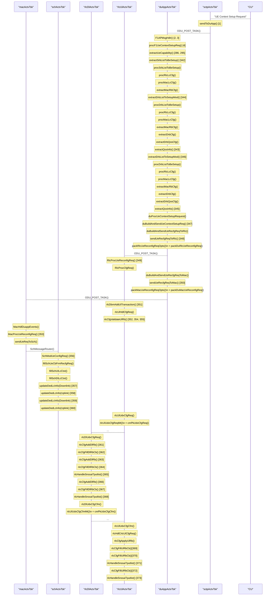
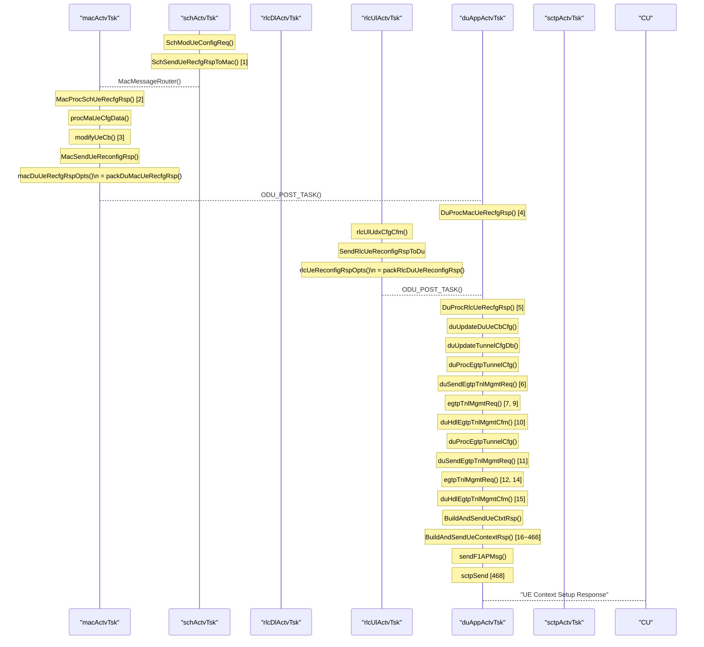
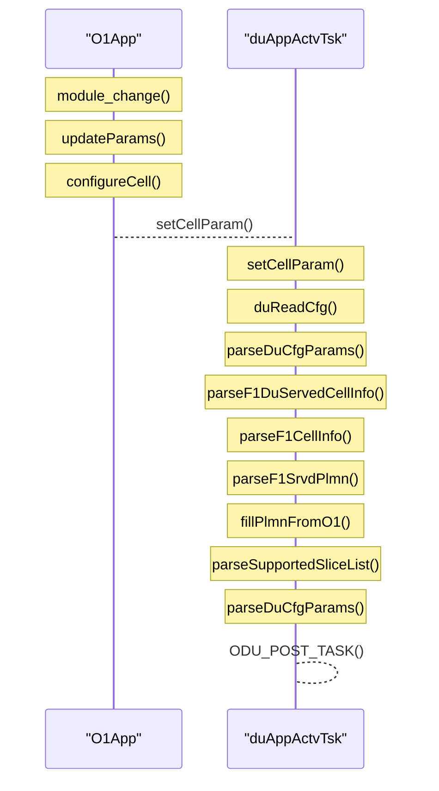
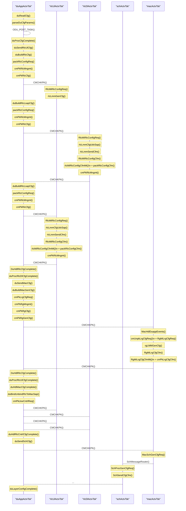
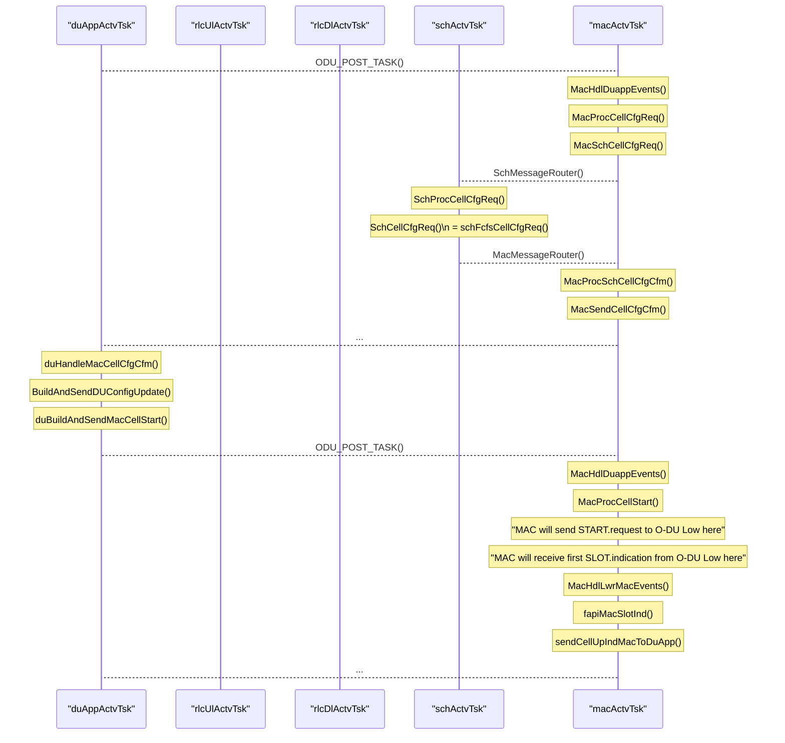
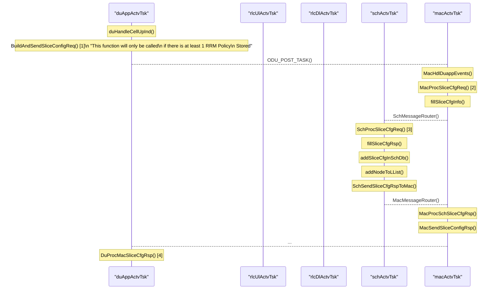
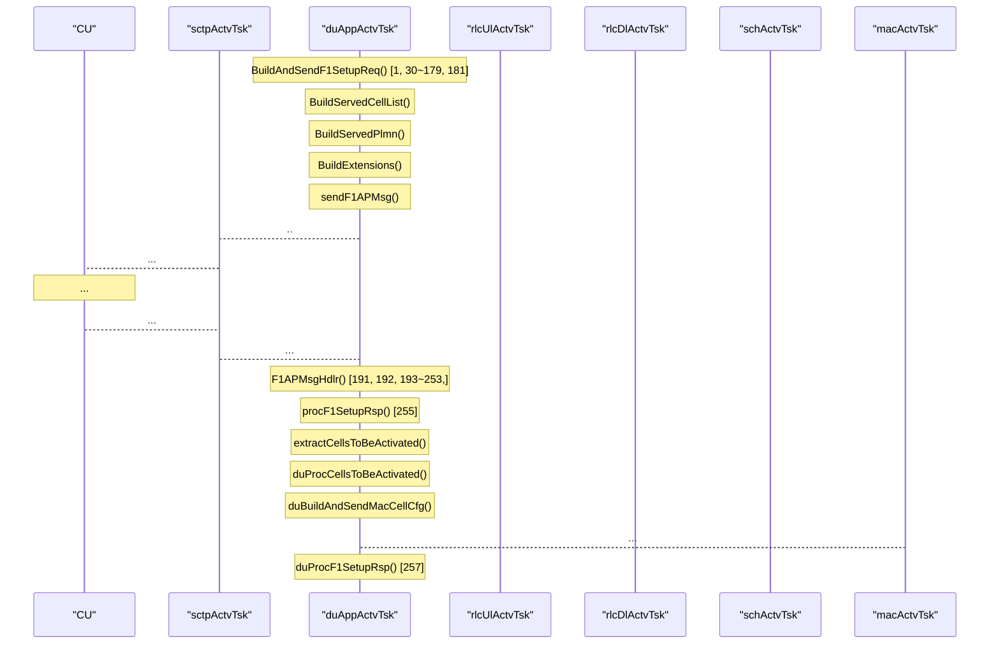
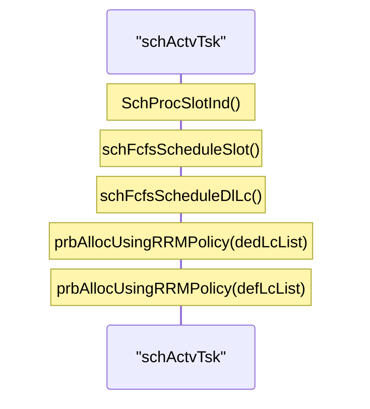

# 2024/09/13 Study Note (Define Current OSC DU High Functions & Parameters for RAN Slicing)

###### tags: `2024`


**Goal:**
- [x] [Define Current OSC DU High Functions & Parameters for RAN Slicing](#0-Summary)


 
**References:**
- [O-DU High Overview](https://docs.o-ran-sc.org/projects/o-ran-sc-o-du-l2/en/latest/overview.html)
- [o-du-l2 j-release](https://github.com/o-ran-sc/o-du-l2/tree/j-release)
- [RAN Slicing Architecture Requirements](https://github.com/bmw-ece-ntust/guideline-template/blob/wilfridAzariah/studyNotes/20240815%20Study%20Note%20(RAN%20Slicing%20Architecture%20Requirements).md)
- [Analyze what are the available in OSC and OAI for RAN slicing](https://github.com/bmw-ece-ntust/guideline-template/blob/wilfridAzariah/studyNotes/20240820%20Study%20Note%20(Analyze%20what%20are%20the%20available%20in%20OSC%20and%20OAI%20for%20RAN%20slicing).md)


**Contents:**
- [2024/09/13 Study Note (Define Current OSC DU High Functions & Parameters for RAN Slicing)](#2024-09-13-study-note--define-current-osc-du-high-functions---parameters-for-ran-slicing-)
          + [tags: `2024`](#tags---2024-)
  * [0. Summary](#0-summary)
    + [0.1. OSC DU's Thread](#01-osc-du-s-thread)
  * [1. UE Context Setup Request](#1-ue-context-setup-request)
  * [2. UE Context Setup Response](#2-ue-context-setup-response)
  * [3. Slice Configuration](#3-slice-configuration)
    + [3.1. Before F1 Setup](#31-before-f1-setup)
    + [3.2. After F1 Setup](#32-after-f1-setup)
  * [4. Supported Slice Report to CU](#4-supported-slice-report-to-cu)
  * [5. Slice RRM Policy Based PRB Allocation](#5-slice-rrm-policy-based-prb-allocation)

<small><i><a href='http://ecotrust-canada.github.io/markdown-toc/'>Table of contents generated with markdown-toc</a></i></small>


## 0. Summary


1. DU's [slice configuration](#3-Slice-Configuration) from configuration file or O1 is stored in database

2. [UE Context Setup Request](#1-UE-Context-Setup-Request) care about slice and will create DRB/LC based on Slice sNSSAI:
    - If RRM Policy rule for that slice not exist yet in SCH DB, the DRB/LC will be included into default slice
    - If RRM Policy rule for that slice already exist in SCH DB, the DRB/LC will be get the dedicated PRB quota based on dedicated Ratio of RRM Policy

3. DU's slice configuration is reported to CU in [F1 Setup request](#4-Supported-Slice-Report-to-CU)

4. Having slice configured to the DU does not mean that the DU will treat each slice differently. DU will treat slice differently only after receive RRM policy for the slice:
    - **Problem**: However, the current OSC DU High Flow will not update the PRB quota of a UE that has already Setup PDU Session before RRM Policy is updated.

5. OSC DU High will do [Slice RRM Policy Based PRB Allocation](#5-Slice-RRM-Policy-Based-PRB-Allocation) only after receive RRM policy for the slice

### 0.1. OSC DU's Thread


Dotted box means mac, rlcDl, and sch is 3 task in 1 thread


## 1. UE Context Setup Request


**Important**:
- `fillSchUlLcCtxt()` and `fillSchDlLcCtxt()` will add/delete number of active logical channel (or DRB) of a UE
- `updateDedLcInfo()` will select which slice is each LC/DRB belong to and set the Dedicated PRB Quota for each LC




Example Log
```shell=
DEBUG   -->  SCTP : Forwarding received message to duApp
INFO  -->  F1AP : Received F1AP message buffer
DEBUG   -->  F1AP : Received flat buffer to be decoded : 050ffffff80ffffffdb00b02802010294020103f09013fffffff1ffffff8400001006b010060401009015201310222000000000ffffffa013ffffff800ffffff81ffffffb003640f003540a013fffffff1ffffff84000010004a060049401802306d402240320200ffffffa440218ffffffc0900000074000ffffffb44011ffffff8040234001890000007403effffffc0ffffffa8ffffff825200012002240320600ffffffa440218ffffffc0900000074000ffffffb44011ffffff81406780018900000074
<F1AP-PDU>
    <initiatingMessage>
        <procedureCode>5</procedureCode>
        <criticality><reject/></criticality>
        <value>
            <UEContextSetupRequest>
                <protocolIEs>
                    <UEContextSetupRequestIEs>
                        <id>40</id>
                        <criticality><reject/></criticality>
                        <value>
                            <GNB-CU-UE-F1AP-ID>1</GNB-CU-UE-F1AP-ID>
                        </value>
                    </UEContextSetupRequestIEs>
                    <UEContextSetupRequestIEs>
                        <id>41</id>
                        <criticality><ignore/></criticality>
                        <value>
                            <GNB-DU-UE-F1AP-ID>1</GNB-DU-UE-F1AP-ID>
                        </value>
                    </UEContextSetupRequestIEs>
                    <UEContextSetupRequestIEs>
                        <id>63</id>
                        <criticality><reject/></criticality>
                        <value>
                            <NRCGI>
                                <pLMN-Identity>13 F1 84</pLMN-Identity>
                                <nRCellIdentity>
                                    000000000000000000000000000000000001
                                </nRCellIdentity>
                            </NRCGI>
                        </value>
                    </UEContextSetupRequestIEs>
                    <UEContextSetupRequestIEs>
                        <id>107</id>
                        <criticality><reject/></criticality>
                        <value>
                            <ServCellIndex>0</ServCellIndex>
                        </value>
                    </UEContextSetupRequestIEs>
                    <UEContextSetupRequestIEs>
                        <id>96</id>
                        <criticality><ignore/></criticality>
                        <value>
                            <CellULConfigured><none/></CellULConfigured>
                        </value>
                    </UEContextSetupRequestIEs>
                    <UEContextSetupRequestIEs>
                        <id>9</id>
                        <criticality><reject/></criticality>
                        <value>
                            <CUtoDURRCInformation>
                                <uE-CapabilityRAT-ContainerList>
                                    10 22 02 00 00 00 00 00 00 00 00 00 A0 01 03 80 
                                    00 81 B0
                                </uE-CapabilityRAT-ContainerList>
                            </CUtoDURRCInformation>
                        </value>
                    </UEContextSetupRequestIEs>
                    <UEContextSetupRequestIEs>
                        <id>54</id>
                        <criticality><ignore/></criticality>
                        <value>
                            <SCell-ToBeSetup-List>
                                <ProtocolIE-SingleContainer>
                                    <id>53</id>
                                    <criticality><ignore/></criticality>
                                    <value>
                                        <SCell-ToBeSetup-Item>
                                            <sCell-ID>
                                                <pLMN-Identity>13 F1 84</pLMN-Identity>
                                                <nRCellIdentity>
                                                    000000000000000000000000000000000001
                                                </nRCellIdentity>
                                            </sCell-ID>
                                            <sCellIndex>1</sCellIndex>
                                        </SCell-ToBeSetup-Item>
                                    </value>
                                </ProtocolIE-SingleContainer>
                            </SCell-ToBeSetup-List>
                        </value>
                    </UEContextSetupRequestIEs>
                    <UEContextSetupRequestIEs>
                        <id>74</id>
                        <criticality><reject/></criticality>
                        <value>
                            <SRBs-ToBeSetup-List>
                                <ProtocolIE-SingleContainer>
                                    <id>73</id>
                                    <criticality><ignore/></criticality>
                                    <value>
                                        <SRBs-ToBeSetup-Item>
                                            <sRBID>2</sRBID>
                                        </SRBs-ToBeSetup-Item>
                                    </value>
                                </ProtocolIE-SingleContainer>
                            </SRBs-ToBeSetup-List>
                        </value>
                    </UEContextSetupRequestIEs>
                    <UEContextSetupRequestIEs>
                        <id>35</id>
                        <criticality><reject/></criticality>
                        <value>
                            <DRBs-ToBeSetup-List>
                                <ProtocolIE-SingleContainer>
                                    <id>34</id>
                                    <criticality><ignore/></criticality>
                                    <value>
                                        <DRBs-ToBeSetup-Item>
                                            <dRBID>1</dRBID>
                                            <qoSInformation>
                                                <choice-extension>
                                                    <id>164</id>
                                                    <criticality><ignore/></criticality>
                                                    <value>
                                                        <DRB-Information>
                                                            <dRB-QoS>
                                                                <qoS-Characteristics>
                                                                    <non-Dynamic-5QI>
                                                                        <fiveQI>9</fiveQI>
                                                                        <averagingWindow>0</averagingWindow>
                                                                        <maxDataBurstVolume>0</maxDataBurstVolume>
                                                                    </non-Dynamic-5QI>
                                                                </qoS-Characteristics>
                                                                <nGRANallocationRetentionPriority>
                                                                    <priorityLevel>14</priorityLevel>
                                                                    <pre-emptionCapability><may-trigger-pre-emption/></pre-emptionCapability>
                                                                    <pre-emptionVulnerability><not-pre-emptable/></pre-emptionVulnerability>
                                                                </nGRANallocationRetentionPriority>
                                                                <iE-Extensions>
                                                                    <QoSFlowLevelQoSParameters-ExtIEs>
                                                                        <id>180</id>
                                                                        <criticality><ignore/></criticality>
                                                                        <extensionValue>
                                                                            <PDUSessionID>1</PDUSessionID>
                                                                        </extensionValue>
                                                                    </QoSFlowLevelQoSParameters-ExtIEs>
                                                                </iE-Extensions>
                                                            </dRB-QoS>
                                                            <sNSSAI>
                                                                <sST>01</sST>
                                                                <sD>02 03 04</sD>
                                                            </sNSSAI>
                                                            <flows-Mapped-To-DRB-List>
                                                                <Flows-Mapped-To-DRB-Item>
                                                                    <qoSFlowIdentifier>0</qoSFlowIdentifier>
                                                                    <qoSFlowLevelQoSParameters>
                                                                        <qoS-Characteristics>
                                                                            <non-Dynamic-5QI>
                                                                                <fiveQI>9</fiveQI>
                                                                                <averagingWindow>0</averagingWindow>
                                                                                <maxDataBurstVolume>0</maxDataBurstVolume>
                                                                            </non-Dynamic-5QI>
                                                                        </qoS-Characteristics>
                                                                        <nGRANallocationRetentionPriority>
                                                                            <priorityLevel>14</priorityLevel>
                                                                            <pre-emptionCapability><may-trigger-pre-emption/></pre-emptionCapability>
                                                                            <pre-emptionVulnerability><not-pre-emptable/></pre-emptionVulnerability>
                                                                        </nGRANallocationRetentionPriority>
                                                                    </qoSFlowLevelQoSParameters>
                                                                </Flows-Mapped-To-DRB-Item>
                                                            </flows-Mapped-To-DRB-List>
                                                        </DRB-Information>
                                                    </value>
                                                </choice-extension>
                                            </qoSInformation>
                                            <uLUPTNLInformation-ToBeSetup-List>
                                                <ULUPTNLInformation-ToBeSetup-Item>
                                                    <uLUPTNLInformation>
                                                        <gTPTunnel>
                                                            <transportLayerAddress>
                                                                11000000101010001000001001010010
                                                            </transportLayerAddress>
                                                            <gTP-TEID>00 00 00 01</gTP-TEID>
                                                        </gTPTunnel>
                                                    </uLUPTNLInformation>
                                                </ULUPTNLInformation-ToBeSetup-Item>
                                            </uLUPTNLInformation-ToBeSetup-List>
                                            <rLCMode><rlc-um-bidirectional/></rLCMode>
                                        </DRBs-ToBeSetup-Item>
                                    </value>
                                </ProtocolIE-SingleContainer>
                                <ProtocolIE-SingleContainer>
                                    <id>34</id>
                                    <criticality><ignore/></criticality>
                                    <value>
                                        <DRBs-ToBeSetup-Item>
                                            <dRBID>2</dRBID>
                                            <qoSInformation>
                                                <choice-extension>
                                                    <id>164</id>
                                                    <criticality><ignore/></criticality>
                                                    <value>
                                                        <DRB-Information>
                                                            <dRB-QoS>
                                                                <qoS-Characteristics>
                                                                    <non-Dynamic-5QI>
                                                                        <fiveQI>9</fiveQI>
                                                                        <averagingWindow>0</averagingWindow>
                                                                        <maxDataBurstVolume>0</maxDataBurstVolume>
                                                                    </non-Dynamic-5QI>
                                                                </qoS-Characteristics>
                                                                <nGRANallocationRetentionPriority>
                                                                    <priorityLevel>14</priorityLevel>
                                                                    <pre-emptionCapability><may-trigger-pre-emption/></pre-emptionCapability>
                                                                    <pre-emptionVulnerability><not-pre-emptable/></pre-emptionVulnerability>
                                                                </nGRANallocationRetentionPriority>
                                                                <iE-Extensions>
                                                                    <QoSFlowLevelQoSParameters-ExtIEs>
                                                                        <id>180</id>
                                                                        <criticality><ignore/></criticality>
                                                                        <extensionValue>
                                                                            <PDUSessionID>1</PDUSessionID>
                                                                        </extensionValue>
                                                                    </QoSFlowLevelQoSParameters-ExtIEs>
                                                                </iE-Extensions>
                                                            </dRB-QoS>
                                                            <sNSSAI>
                                                                <sST>05</sST>
                                                                <sD>06 07 08</sD>
                                                            </sNSSAI>
                                                            <flows-Mapped-To-DRB-List>
                                                                <Flows-Mapped-To-DRB-Item>
                                                                    <qoSFlowIdentifier>0</qoSFlowIdentifier>
                                                                    <qoSFlowLevelQoSParameters>
                                                                        <qoS-Characteristics>
                                                                            <non-Dynamic-5QI>
                                                                                <fiveQI>9</fiveQI>
                                                                                <averagingWindow>0</averagingWindow>
                                                                                <maxDataBurstVolume>0</maxDataBurstVolume>
                                                                            </non-Dynamic-5QI>
                                                                        </qoS-Characteristics>
                                                                        <nGRANallocationRetentionPriority>
                                                                            <priorityLevel>14</priorityLevel>
                                                                            <pre-emptionCapability><may-trigger-pre-emption/></pre-emptionCapability>
                                                                            <pre-emptionVulnerability><not-pre-emptable/></pre-emptionVulnerability>
                                                                        </nGRANallocationRetentionPriority>
                                                                    </qoSFlowLevelQoSParameters>
                                                                </Flows-Mapped-To-DRB-Item>
                                                            </flows-Mapped-To-DRB-List>
                                                        </DRB-Information>
                                                    </value>
                                                </choice-extension>
                                            </qoSInformation>
                                            <uLUPTNLInformation-ToBeSetup-List>
                                                <ULUPTNLInformation-ToBeSetup-Item>
                                                    <uLUPTNLInformation>
                                                        <gTPTunnel>
                                                            <transportLayerAddress>
                                                                11000000101010001000001001010010
                                                            </transportLayerAddress>
                                                            <gTP-TEID>00 00 00 02</gTP-TEID>
                                                        </gTPTunnel>
                                                    </uLUPTNLInformation>
                                                </ULUPTNLInformation-ToBeSetup-Item>
                                            </uLUPTNLInformation-ToBeSetup-List>
                                            <rLCMode><rlc-um-bidirectional/></rLCMode>
                                        </DRBs-ToBeSetup-Item>
                                    </value>
                                </ProtocolIE-SingleContainer>
                            </DRBs-ToBeSetup-List>
                        </value>
                    </UEContextSetupRequestIEs>
                    <UEContextSetupRequestIEs>
                        <id>184</id>
                        <criticality><ignore/></criticality>
                        <value>
                            <RRCDeliveryStatusRequest><true/></RRCDeliveryStatusRequest>
                        </value>
                    </UEContextSetupRequestIEs>
                    <UEContextSetupRequestIEs>
                        <id>158</id>
                        <criticality><ignore/></criticality>
                        <value>
                            <BitRate>993522893</BitRate>
                        </value>
                    </UEContextSetupRequestIEs>
                </protocolIEs>
            </UEContextSetupRequest>
        </value>
    </initiatingMessage>
</F1AP-PDU>
<UE-CapabilityRAT-ContainerListRRC>
    <UE-CapabilityRAT-Container>
        <rat-Type><nr/></rat-Type>
        <ue-CapabilityRAT-Container>
            01 00 00 00 00 00 00 00 00 00 50 00 81 C0 00 40 
            D8
        </ue-CapabilityRAT-Container>
    </UE-CapabilityRAT-Container>
</UE-CapabilityRAT-ContainerListRRC>
<UE-NR-Capability>
    <accessStratumRelease><rel15/></accessStratumRelease>
    <pdcp-Parameters>
        <supportedROHC-Profiles>
            <profile0x0000><false/></profile0x0000>
            <profile0x0001><false/></profile0x0001>
            <profile0x0002><false/></profile0x0002>
            <profile0x0003><false/></profile0x0003>
            <profile0x0004><false/></profile0x0004>
            <profile0x0006><false/></profile0x0006>
            <profile0x0101><false/></profile0x0101>
            <profile0x0102><false/></profile0x0102>
            <profile0x0103><false/></profile0x0103>
            <profile0x0104><false/></profile0x0104>
        </supportedROHC-Profiles>
        <maxNumberROHC-ContextSessions><cs2/></maxNumberROHC-ContextSessions>
    </pdcp-Parameters>
    <phy-Parameters>
    </phy-Parameters>
    <rf-Parameters>
        <supportedBandListNR>
            <BandNR>
                <bandNR>1</bandNR>
            </BandNR>
        </supportedBandListNR>
    </rf-Parameters>
    <featureSets>
        <featureSetsDownlinkPerCC>
            <FeatureSetDownlinkPerCC>
                <supportedSubcarrierSpacingDL><kHz15/></supportedSubcarrierSpacingDL>
                <supportedBandwidthDL>
                    <fr1><mhz20/></fr1>
                </supportedBandwidthDL>
                <supportedModulationOrderDL><qam64/></supportedModulationOrderDL>
            </FeatureSetDownlinkPerCC>
        </featureSetsDownlinkPerCC>
        <featureSetsUplinkPerCC>
            <FeatureSetUplinkPerCC>
                <supportedSubcarrierSpacingUL><kHz15/></supportedSubcarrierSpacingUL>
                <supportedBandwidthUL>
                    <fr1><mhz20/></fr1>
                </supportedBandwidthUL>
                <supportedModulationOrderUL><qam16/></supportedModulationOrderUL>
            </FeatureSetUplinkPerCC>
        </featureSetsUplinkPerCC>
    </featureSets>
</UE-NR-Capability>
DEBUG --> DUAPP: extractSrbListToSetup: SRBID: 2 [RLC,MAC,NumDrb]:[1,1,0]
DEBUG -->  DU_F1AP : extractQosInfo: PDU SessionID:1
DEBUG --> DUAPP: extractDrbListToSetupMod:lcId:4 ,BitMap:10, [RLC,MAC,NumDrb]:[2,2,1]
DEBUG -->  DU_F1AP : extractQosInfo: PDU SessionID:1
DEBUG --> DUAPP: extractDrbListToSetupMod:lcId:5 ,BitMap:30, [RLC,MAC,NumDrb]:[3,3,2]
DEBUG   -->  DU_APP: Processing Ue Context Setup Request for cellId [1]
DEBUG   -->  DU_APP: Sending Ue Reconfig Request to RLC UL
DEBUG  -->  RLC: UE reconfig request received. CellID[1] UEID[1]
DEBUG   -->  DU_APP: Sending Ue Reconfig Request to MAC
DEBUG  -->  RLC_UL : (transId(2))
DEBUG  -->  RLC_UL : cellId(1), cfgType(1)
INFO  -->  MAC : UE Reconfig Request for CRNTI[100]
DEBUG  -->  RLC_UL : cellId(1), cfgType(1)
DEBUG  -->  RLC_UL : cellId(1), cfgType(1)
DEBUG  -->  SCH : Modifying Ue Config Request for CRNTI[100]
INFO  -->  SCH : Updated RRM policy, reservedPOOL:10
INFO  -->  SCH : Updated RRM policy, reservedPOOL:10
INFO  -->  SCH : This SNSSAI is not a part of this RRMPolicy
INFO  -->  SCH : This SNSSAI is not a part of this RRMPolicy
DEBUG  -->  RLC_DL : rlcCfgAddRb(cellId(1),UEID:1 cfgType(1))
DEBUG  -->  RLC_DL : rlcCfgFillRbCb(ueId(1),cellId(1) rbType(0))
DEBUG  -->  RLC_DL : rlcCfgAddRb(cellId(1),UEID:1 cfgType(1))
DEBUG  -->  RLC_DL : rlcCfgFillRbCb(ueId(1),cellId(1) rbType(1))
DEBUG  --> RLC : SNSSAI node added successfully
DEBUG  -->  RLC_DL : rlcCfgAddRb(cellId(1),UEID:1 cfgType(1))
DEBUG  -->  RLC_DL : rlcCfgFillRbCb(ueId(1),cellId(1) rbType(1))
DEBUG  --> RLC : SNSSAI node added successfully
DEBUG  -->  RLC_UL : rlcCfgFillRbCb(cellId(1), rbId(2), rbType(0))
DEBUG  -->  RLC_UL : rlcCfgFillRbCb(cellId(1), rbId(1), rbType(1))
DEBUG  --> RLC : SNSSAI node added successfully
DEBUG  -->  RLC_UL : rlcCfgFillRbCb(cellId(1), rbId(2), rbType(1))
DEBUG  --> RLC : SNSSAI node added successfully
```


## 2. UE Context Setup Response



Example Log
```shell=
INFO  -->  SCH :  Sending UE Reconfig response to MAC
INFO  -->  MAC: SCH UeReconfigRsp for CRNTI[100] is success in MacProcSchUeCfgRsp()
INFO  -->  MAC : Modifying Ue config Req for CRNTI 100 
INFO   -->  DU APP : MAC UE Reconfig Response : SUCCESS [DU UE F1AP ID : 1]
INFO   -->  DU_APP: RLC UE Reconfig Response : SUCCESS [UE IDX:1]
DEBUG   -->  DU_APP : Sending EGTP tunnel management request for teId [1]
DEBUG   -->  EGTP : Received tunnel management request
INFO   -->  EGTP : Tunnel addition : LocalTeid[1] Remote Teid[1]
DEBUG   -->  EGTP : Sending Tunnel management confirmation
DEBUG  -->  DU_APP: Tunnel management confirm OK
DEBUG   -->  DU_APP : Sending EGTP tunnel management request for teId [2]
DEBUG   -->  EGTP : Received tunnel management request
INFO   -->  EGTP : Tunnel addition : LocalTeid[2] Remote Teid[2]
DEBUG   -->  EGTP : Sending Tunnel management confirmation
DEBUG  -->  DU_APP: Tunnel management confirm OK
 INFO   -->  F1AP : Building UE Context Setup Response for cellId 1, ueId 1
<CellGroupConfigRrc>
    <cellGroupId>0</cellGroupId>
    <rlc-BearerToAddModList>
        <RLC-BearerConfig>
            <logicalChannelIdentity>2</logicalChannelIdentity>
            <servedRadioBearer>
                <srb-Identity>2</srb-Identity>
            </servedRadioBearer>
            <rlc-Config>
                <am>
                    <ul-AM-RLC>
                        <sn-FieldLength><size12/></sn-FieldLength>
                        <t-PollRetransmit><ms45/></t-PollRetransmit>
                        <pollPDU><p4/></pollPDU>
                        <pollByte><infinity/></pollByte>
                        <maxRetxThreshold><t8/></maxRetxThreshold>
                    </ul-AM-RLC>
                    <dl-AM-RLC>
                        <sn-FieldLength><size12/></sn-FieldLength>
                        <t-Reassembly><ms40/></t-Reassembly>
                        <t-StatusProhibit><ms35/></t-StatusProhibit>
                    </dl-AM-RLC>
                </am>
            </rlc-Config>
            <mac-LogicalChannelConfig>
                <ul-SpecificParameters>
                    <priority>1</priority>
                    <prioritisedBitRate><infinity/></prioritisedBitRate>
                    <bucketSizeDuration><ms1000/></bucketSizeDuration>
                    <logicalChannelGroup>0</logicalChannelGroup>
                    <schedulingRequestID>0</schedulingRequestID>
                    <logicalChannelSR-Mask><false/></logicalChannelSR-Mask>
                    <logicalChannelSR-DelayTimerApplied><false/></logicalChannelSR-DelayTimerApplied>
                </ul-SpecificParameters>
            </mac-LogicalChannelConfig>
        </RLC-BearerConfig>
        <RLC-BearerConfig>
            <logicalChannelIdentity>4</logicalChannelIdentity>
            <servedRadioBearer>
                <drb-Identity>1</drb-Identity>
            </servedRadioBearer>
            <rlc-Config>
                <um-Bi-Directional>
                    <ul-UM-RLC>
                        <sn-FieldLength><size12/></sn-FieldLength>
                    </ul-UM-RLC>
                    <dl-UM-RLC>
                        <sn-FieldLength><size12/></sn-FieldLength>
                        <t-Reassembly><ms40/></t-Reassembly>
                    </dl-UM-RLC>
                </um-Bi-Directional>
            </rlc-Config>
            <mac-LogicalChannelConfig>
                <ul-SpecificParameters>
                    <priority>1</priority>
                    <prioritisedBitRate><infinity/></prioritisedBitRate>
                    <bucketSizeDuration><ms1000/></bucketSizeDuration>
                    <logicalChannelGroup>0</logicalChannelGroup>
                    <schedulingRequestID>0</schedulingRequestID>
                    <logicalChannelSR-Mask><false/></logicalChannelSR-Mask>
                    <logicalChannelSR-DelayTimerApplied><false/></logicalChannelSR-DelayTimerApplied>
                </ul-SpecificParameters>
            </mac-LogicalChannelConfig>
        </RLC-BearerConfig>
        <RLC-BearerConfig>
            <logicalChannelIdentity>5</logicalChannelIdentity>
            <servedRadioBearer>
                <drb-Identity>2</drb-Identity>
            </servedRadioBearer>
            <rlc-Config>
                <um-Bi-Directional>
                    <ul-UM-RLC>
                        <sn-FieldLength><size12/></sn-FieldLength>
                    </ul-UM-RLC>
                    <dl-UM-RLC>
                        <sn-FieldLength><size12/></sn-FieldLength>
                        <t-Reassembly><ms40/></t-Reassembly>
                    </dl-UM-RLC>
                </um-Bi-Directional>
            </rlc-Config>
            <mac-LogicalChannelConfig>
                <ul-SpecificParameters>
                    <priority>1</priority>
                    <prioritisedBitRate><infinity/></prioritisedBitRate>
                    <bucketSizeDuration><ms1000/></bucketSizeDuration>
                    <logicalChannelGroup>0</logicalChannelGroup>
                    <schedulingRequestID>0</schedulingRequestID>
                    <logicalChannelSR-Mask><false/></logicalChannelSR-Mask>
                    <logicalChannelSR-DelayTimerApplied><false/></logicalChannelSR-DelayTimerApplied>
                </ul-SpecificParameters>
            </mac-LogicalChannelConfig>
        </RLC-BearerConfig>
    </rlc-BearerToAddModList>
    <mac-CellGroupConfig>
        <schedulingRequestConfig>
            <schedulingRequestToAddModList>
                <SchedulingRequestToAddMod>
                    <schedulingRequestId>0</schedulingRequestId>
                    <sr-ProhibitTimer><ms32/></sr-ProhibitTimer>
                    <sr-TransMax><n16/></sr-TransMax>
                </SchedulingRequestToAddMod>
            </schedulingRequestToAddModList>
        </schedulingRequestConfig>
        <bsr-Config>
            <periodicBSR-Timer><sf10/></periodicBSR-Timer>
            <retxBSR-Timer><sf320/></retxBSR-Timer>
            <logicalChannelSR-DelayTimer><sf2560/></logicalChannelSR-DelayTimer>
        </bsr-Config>
        <tag-Config>
            <tag-ToAddModList>
                <TAG>
                    <tag-Id>0</tag-Id>
                    <timeAlignmentTimer><infinity/></timeAlignmentTimer>
                </TAG>
            </tag-ToAddModList>
        </tag-Config>
        <phr-Config>
            <setup>
                <phr-PeriodicTimer><infinity/></phr-PeriodicTimer>
                <phr-ProhibitTimer><sf0/></phr-ProhibitTimer>
                <phr-Tx-PowerFactorChange><infinity/></phr-Tx-PowerFactorChange>
                <multiplePHR><false/></multiplePHR>
                <dummy><false/></dummy>
                <phr-Type2OtherCell><false/></phr-Type2OtherCell>
                <phr-ModeOtherCG><real/></phr-ModeOtherCG>
            </setup>
        </phr-Config>
        <skipUplinkTxDynamic><false/></skipUplinkTxDynamic>
    </mac-CellGroupConfig>
    <physicalCellGroupConfig>
        <p-NR-FR1>0</p-NR-FR1>
        <pdsch-HARQ-ACK-Codebook><dynamic/></pdsch-HARQ-ACK-Codebook>
    </physicalCellGroupConfig>
    <spCellConfig>
        <servCellIndex>0</servCellIndex>
        <rlmInSyncOutOfSyncThreshold><n1/></rlmInSyncOutOfSyncThreshold>
        <spCellConfigDedicated>
            <initialDownlinkBWP>
                <pdcch-Config>
                    <setup>
                        <controlResourceSetToAddModList>
                            <ControlResourceSet>
                                <controlResourceSetId>1</controlResourceSetId>
                                <frequencyDomainResources>
                                    000000000111100000000000000000000000000000000
                                </frequencyDomainResources>
                                <duration>2</duration>
                                <cce-REG-MappingType>
                                    <nonInterleaved></nonInterleaved>
                                </cce-REG-MappingType>
                                <precoderGranularity><allContiguousRBs/></precoderGranularity>
                                <pdcch-DMRS-ScramblingID>1</pdcch-DMRS-ScramblingID>
                            </ControlResourceSet>
                        </controlResourceSetToAddModList>
                        <searchSpacesToAddModList>
                            <SearchSpace>
                                <searchSpaceId>2</searchSpaceId>
                                <controlResourceSetId>1</controlResourceSetId>
                                <monitoringSlotPeriodicityAndOffset>
                                    <sl1></sl1>
                                </monitoringSlotPeriodicityAndOffset>
                                <monitoringSymbolsWithinSlot>
                                    10000000000000
                                </monitoringSymbolsWithinSlot>
                                <nrofCandidates>
                                    <aggregationLevel1><n8/></aggregationLevel1>
                                    <aggregationLevel2><n8/></aggregationLevel2>
                                    <aggregationLevel4><n4/></aggregationLevel4>
                                    <aggregationLevel8><n2/></aggregationLevel8>
                                    <aggregationLevel16><n1/></aggregationLevel16>
                                </nrofCandidates>
                                <searchSpaceType>
                                    <ue-Specific>
                                        <dci-Formats><formats0-0-And-1-0/></dci-Formats>
                                    </ue-Specific>
                                </searchSpaceType>
                            </SearchSpace>
                        </searchSpacesToAddModList>
                    </setup>
                </pdcch-Config>
                <pdsch-Config>
                    <setup>
                        <dmrs-DownlinkForPDSCH-MappingTypeA>
                            <setup>
                                <dmrs-AdditionalPosition><pos0/></dmrs-AdditionalPosition>
                            </setup>
                        </dmrs-DownlinkForPDSCH-MappingTypeA>
                        <resourceAllocation><resourceAllocationType1/></resourceAllocation>
                        <pdsch-TimeDomainAllocationList>
                            <setup>
                                <PDSCH-TimeDomainResourceAllocation>
                                    <mappingType><typeA/></mappingType>
                                    <startSymbolAndLength>66</startSymbolAndLength>
                                </PDSCH-TimeDomainResourceAllocation>
                                <PDSCH-TimeDomainResourceAllocation>
                                    <k0>1</k0>
                                    <mappingType><typeA/></mappingType>
                                    <startSymbolAndLength>66</startSymbolAndLength>
                                </PDSCH-TimeDomainResourceAllocation>
                            </setup>
                        </pdsch-TimeDomainAllocationList>
                        <rbg-Size><config1/></rbg-Size>
                        <maxNrofCodeWordsScheduledByDCI><n1/></maxNrofCodeWordsScheduledByDCI>
                        <prb-BundlingType>
                            <staticBundling>
                            </staticBundling>
                        </prb-BundlingType>
                    </setup>
                </pdsch-Config>
            </initialDownlinkBWP>
            <firstActiveDownlinkBWP-Id>0</firstActiveDownlinkBWP-Id>
            <defaultDownlinkBWP-Id>0</defaultDownlinkBWP-Id>
            <uplinkConfig>
                <initialUplinkBWP>
                    <pucch-Config>
                        <setup>
                            <resourceSetToAddModList>
                                <PUCCH-ResourceSet>
                                    <pucch-ResourceSetId>1</pucch-ResourceSetId>
                                    <resourceList>
                                        <PUCCH-ResourceId>1</PUCCH-ResourceId>
                                    </resourceList>
                                </PUCCH-ResourceSet>
                            </resourceSetToAddModList>
                            <resourceToAddModList>
                                <PUCCH-Resource>
                                    <pucch-ResourceId>1</pucch-ResourceId>
                                    <startingPRB>0</startingPRB>
                                    <format>
                                        <format1>
                                            <initialCyclicShift>0</initialCyclicShift>
                                            <nrofSymbols>4</nrofSymbols>
                                            <startingSymbolIndex>0</startingSymbolIndex>
                                            <timeDomainOCC>0</timeDomainOCC>
                                        </format1>
                                    </format>
                                </PUCCH-Resource>
                            </resourceToAddModList>
                            <format1>
                                <setup>
                                    <nrofSlots><n4/></nrofSlots>
                                </setup>
                            </format1>
                            <dl-DataToUL-ACK>
                                <INTEGER>1</INTEGER>
                                <INTEGER>2</INTEGER>
                            </dl-DataToUL-ACK>
                        </setup>
                    </pucch-Config>
                    <pusch-Config>
                        <setup>
                            <dataScramblingIdentityPUSCH>1</dataScramblingIdentityPUSCH>
                            <dmrs-UplinkForPUSCH-MappingTypeA>
                                <setup>
                                    <dmrs-AdditionalPosition><pos0/></dmrs-AdditionalPosition>
                                    <transformPrecodingDisabled>
                                        <scramblingID0>1</scramblingID0>
                                    </transformPrecodingDisabled>
                                </setup>
                            </dmrs-UplinkForPUSCH-MappingTypeA>
                            <resourceAllocation><resourceAllocationType1/></resourceAllocation>
                            <pusch-TimeDomainAllocationList>
                                <setup>
                                    <PUSCH-TimeDomainResourceAllocation>
                                        <k2>4</k2>
                                        <mappingType><typeA/></mappingType>
                                        <startSymbolAndLength>66</startSymbolAndLength>
                                    </PUSCH-TimeDomainResourceAllocation>
                                    <PUSCH-TimeDomainResourceAllocation>
                                        <k2>5</k2>
                                        <mappingType><typeA/></mappingType>
                                        <startSymbolAndLength>66</startSymbolAndLength>
                                    </PUSCH-TimeDomainResourceAllocation>
                                </setup>
                            </pusch-TimeDomainAllocationList>
                            <transformPrecoder><disabled/></transformPrecoder>
                        </setup>
                    </pusch-Config>
                    <srs-Config>
                        <setup>
                            <srs-ResourceSetToAddModList>
                                <SRS-ResourceSet>
                                    <srs-ResourceSetId>1</srs-ResourceSetId>
                                    <srs-ResourceIdList>
                                        <SRS-ResourceId>1</SRS-ResourceId>
                                    </srs-ResourceIdList>
                                    <resourceType>
                                        <aperiodic>
                                            <aperiodicSRS-ResourceTrigger>1</aperiodicSRS-ResourceTrigger>
                                        </aperiodic>
                                    </resourceType>
                                    <usage><codebook/></usage>
                                </SRS-ResourceSet>
                            </srs-ResourceSetToAddModList>
                            <srs-ResourceToAddModList>
                                <SRS-Resource>
                                    <srs-ResourceId>1</srs-ResourceId>
                                    <nrofSRS-Ports><port1/></nrofSRS-Ports>
                                    <transmissionComb>
                                        <n2>
                                            <combOffset-n2>0</combOffset-n2>
                                            <cyclicShift-n2>0</cyclicShift-n2>
                                        </n2>
                                    </transmissionComb>
                                    <resourceMapping>
                                        <startPosition>3</startPosition>
                                        <nrofSymbols><n1/></nrofSymbols>
                                        <repetitionFactor><n1/></repetitionFactor>
                                    </resourceMapping>
                                    <freqDomainPosition>0</freqDomainPosition>
                                    <freqDomainShift>0</freqDomainShift>
                                    <freqHopping>
                                        <c-SRS>0</c-SRS>
                                        <b-SRS>0</b-SRS>
                                        <b-hop>0</b-hop>
                                    </freqHopping>
                                    <groupOrSequenceHopping><neither/></groupOrSequenceHopping>
                                    <resourceType>
                                        <aperiodic>
                                        </aperiodic>
                                    </resourceType>
                                    <sequenceId>0</sequenceId>
                                </SRS-Resource>
                            </srs-ResourceToAddModList>
                        </setup>
                    </srs-Config>
                </initialUplinkBWP>
                <firstActiveUplinkBWP-Id>0</firstActiveUplinkBWP-Id>
                <pusch-ServingCellConfig>
                    <setup>
                        <ext1>
                            <maxMIMO-Layers>1</maxMIMO-Layers>
                            <processingType2Enabled><false/></processingType2Enabled>
                        </ext1>
                    </setup>
                </pusch-ServingCellConfig>
            </uplinkConfig>
            <pdsch-ServingCellConfig>
                <setup>
                    <nrofHARQ-ProcessesForPDSCH><n12/></nrofHARQ-ProcessesForPDSCH>
                </setup>
            </pdsch-ServingCellConfig>
            <tag-Id>0</tag-Id>
        </spCellConfigDedicated>
    </spCellConfig>
</CellGroupConfigRrc>

DEBUG   -->  F1AP : Created APER encoded buffer for DuToCuRrcContainer
5c4ffffffb0ffffff9110affffffecffffff81ffffffd061fffffff00ffffffb1ffffffc07d830fffffff8059213effffff84187c01f8ffffffa925ffffffc83dffffffc613ffffffd4ffffffc04b2032ffffffa0220f000070010ffffffdc21803fffffff88ffffffc9810123121414201335540ffffff80ffffff808080ffffff800ffffff88ffffff912affffff84400ffffffc9805ffffff8c4428ffffffa85940ffffff80ffffff8020100201800000c0ffffff80ffffffe0450<F1AP-PDU>
    <successfulOutcome>
        <procedureCode>5</procedureCode>
        <criticality><reject/></criticality>
        <value>
            <UEContextSetupResponse>
                <protocolIEs>
                    <UEContextSetupResponseIEs>
                        <id>40</id>
                        <criticality><reject/></criticality>
                        <value>
                            <GNB-CU-UE-F1AP-ID>1</GNB-CU-UE-F1AP-ID>
                        </value>
                    </UEContextSetupResponseIEs>
                    <UEContextSetupResponseIEs>
                        <id>41</id>
                        <criticality><reject/></criticality>
                        <value>
                            <GNB-DU-UE-F1AP-ID>1</GNB-DU-UE-F1AP-ID>
                        </value>
                    </UEContextSetupResponseIEs>
                    <UEContextSetupResponseIEs>
                        <id>39</id>
                        <criticality><reject/></criticality>
                        <value>
                            <DUtoCURRCInformation>
                                <cellGroupConfig>
                                    5C 04 B0 91 10 0A EC 81 D0 61 F0 00 B1 C0 7D 08 
                                    30 F8 00 59 21 3E 84 18 7C 00 1F 08 A9 25 C8 3D 
                                    C6 01 03 D4 C0 4B 20 32 A0 02 20 0F 00 00 00 00 
                                    70 00 10 DC 21 08 00 3F 88 C9 08 10 12 03 12 14 
                                    14 20 01 33 55 40 80 80 08 00 08 00 80 00 88 91 
                                    2A 84 40 00 C9 08 00 05 8C 44 28 A8 59 40 80 80 
                                    20 10 00 20 18 00 00 00 00 00 0C 00 80 E0 45 00
                                </cellGroupConfig>
                            </DUtoCURRCInformation>
                        </value>
                    </UEContextSetupResponseIEs>
                    <UEContextSetupResponseIEs>
                        <id>95</id>
                        <criticality><reject/></criticality>
                        <value>
                            <C-RNTI>100</C-RNTI>
                        </value>
                    </UEContextSetupResponseIEs>
                    <UEContextSetupResponseIEs>
                        <id>27</id>
                        <criticality><reject/></criticality>
                        <value>
                            <DRBs-Setup-List>
                                <ProtocolIE-SingleContainer>
                                    <id>26</id>
                                    <criticality><reject/></criticality>
                                    <value>
                                        <DRBs-Setup-Item>
                                            <dRBID>1</dRBID>
                                            <dLUPTNLInformation-ToBeSetup-List>
                                                <DLUPTNLInformation-ToBeSetup-Item>
                                                    <dLUPTNLInformation>
                                                        <gTPTunnel>
                                                            <transportLayerAddress>
                                                                11000000101010001000001001010001
                                                            </transportLayerAddress>
                                                            <gTP-TEID>00 00 00 01</gTP-TEID>
                                                        </gTPTunnel>
                                                    </dLUPTNLInformation>
                                                </DLUPTNLInformation-ToBeSetup-Item>
                                            </dLUPTNLInformation-ToBeSetup-List>
                                        </DRBs-Setup-Item>
                                    </value>
                                </ProtocolIE-SingleContainer>
                                <ProtocolIE-SingleContainer>
                                    <id>26</id>
                                    <criticality><reject/></criticality>
                                    <value>
                                        <DRBs-Setup-Item>
                                            <dRBID>2</dRBID>
                                            <dLUPTNLInformation-ToBeSetup-List>
                                                <DLUPTNLInformation-ToBeSetup-Item>
                                                    <dLUPTNLInformation>
                                                        <gTPTunnel>
                                                            <transportLayerAddress>
                                                                11000000101010001000001001010001
                                                            </transportLayerAddress>
                                                            <gTP-TEID>00 00 00 02</gTP-TEID>
                                                        </gTPTunnel>
                                                    </dLUPTNLInformation>
                                                </DLUPTNLInformation-ToBeSetup-Item>
                                            </dLUPTNLInformation-ToBeSetup-List>
                                        </DRBs-Setup-Item>
                                    </value>
                                </ProtocolIE-SingleContainer>
                            </DRBs-Setup-List>
                        </value>
                    </UEContextSetupResponseIEs>
                </protocolIEs>
            </UEContextSetupResponse>
        </value>
    </successfulOutcome>
</F1AP-PDU>

DEBUG   -->  F1AP : Created APER encoded buffer for UE Context Setup Response
4050ffffff80ffffffaf005028020102902010270720705c4ffffffb0ffffff9110affffffecffffff81ffffffd061fffffff00ffffffb1ffffffc07d830fffffff8059213effffff84187c01f8ffffffa925ffffffc83dffffffc613ffffffd4ffffffc04b2032ffffffa0220f000070010ffffffdc21803fffffff88ffffffc9810123121414201335540ffffff80ffffff808080ffffff800ffffff88ffffff912affffff84400ffffffc9805ffffff8c4428ffffffa85940ffffff80ffffff8020100201800000c0ffffff80ffffffe045005f03006401b01f401a0b001fffffffc0ffffffa8ffffff8251000101a0b0ffffff801fffffffc0ffffffa8ffffff82510002
DEBUG  --> SCTP : sending the message to CU
```


## 3. Slice Configuration

### 3.1. Before F1 Setup


Slice Configuration for the DU is stored in `cellParams.plmnList` data structure if `O1_ENABLE` flag is set. Here are some important functions:
- `NRCellDuCb::updateParams()` in O1 module updates the `cellParams.plmnList` based on XML file
- `NRCellDuCb::configureCell()` in O1 module calls `setCellParam()` in duApp
- `setCellParam()` in duApp updates slice configuration in duApp based on `cellParams.plmnList`




Additional MSC after `parseDuCfgParams()`



### 3.2. After F1 Setup


`BuildAndSendSliceConfigReq()` can be called in 2 ways (only 1st way is described in detail):
1. `duHandleCellUpInd()` when there is already RRM Policy when Cell is Up
2. O1 calls `setRrmPolicy()` in duApp


Cell Config and Cell Start before Slice Config





Example Log
```shell=
DEBUG  -->  DU_APP : Sending Slice Cfg Request to MAC 
INFO  -->  MAC : Received Slice Cfg request from DU APP
INFO  -->  SCH : Received Slice Cfg request from MAC
INFO  -->  DU_APP : Slice configured successfully 
```


## 4. Supported Slice Report to CU


DU's Supported Slice Report to the CU is done in `F1 Setup Request`. Here are some important notes:
- After `duLayerConfigComplete()`, the duApp will establish SCTP connection. If SCTP communication successfully up, sctpActvTsk will notify the duApp
- Upon duApp receive sctp communication up, duApp will trigger `F1 Setup Request`




Example Log
```shell=
INFO   -->  F1AP : Building F1 Setup Request

DEBUG   -->  SCTP : AssocId assigned to ricParams from PollParams [95]
<MeasurementTimingConfigurationRrc>
    <criticalExtensions>
        <c1>
DEBUG   -->  SCTP : Assoc change notification received
            <measTimingConf>
                <measTiming>
                    <MeasTiming>
                        <frequencyAndTiming>
                            <carrierFreq>630432</carrierFreq>
                            <ssbSubcarrierSpacing><kHz15/></ssbSubcarrierSpacing>
                            <ssb-MeasurementTimingConfiguration>
                                <periodicityAndOffset>
INFO   -->  Event : CANT START ASSOC                                    <sf20>0</sf20>
                                </periodicityAndOffset>
                                <duration><sf5/></duration>
                            </ssb-MeasurementTimingConfiguration>
                        </frequencyAndTiming>
                    </MeasTiming>
                </measTiming>
            </measTimingConf>
        </c1>
DEBUG   -->  SCTP : Forwarding received message to duApp
    </criticalExtensions>
</MeasurementTimingConfigurationRrc>

DEBUG   -->  F1AP : Created APER encoded buffer for Measurement Timing Configuration 
101133ffffffd4120<F1AP-PDU>
    <initiatingMessage>
        <procedureCode>1</procedureCode>
        <criticality><reject/></criticality>
        <value>
            <F1SetupRequest>
                <protocolIEs>
                    <F1SetupRequestIEs>
                        <id>78</id>
                        <criticality><reject/></criticality>
                        <value>
                            <TransactionID>1</TransactionID>
                        </value>
                    </F1SetupRequestIEs>
                    <F1SetupRequestIEs>
                        <id>42</id>
                        <criticality><reject/></criticality>
                        <value>
                            <GNB-DU-ID>1</GNB-DU-ID>
                        </value>
                    </F1SetupRequestIEs>
                    <F1SetupRequestIEs>
                        <id>45</id>
                        <criticality><ignore/></criticality>
                        <value>
                            <GNB-DU-Name>ORAN OAM DU</GNB-DU-Name>
                        </value>
                    </F1SetupRequestIEs>
                    <F1SetupRequestIEs>
                        <id>44</id>
                        <criticality><reject/></criticality>
                        <value>
                            <GNB-DU-Served-Cells-List>
                                <ProtocolIE-SingleContainer>
                                    <id>43</id>
                                    <criticality><reject/></criticality>
                                    <value>
                                        <GNB-DU-Served-Cells-Item>
                                            <served-Cell-Information>
                                                <nRCGI>
                                                    <pLMN-Identity>13 F1 84</pLMN-Identity>
                                                    <nRCellIdentity>
                                                        000000000000000000000000000000000001
                                                    </nRCellIdentity>
                                                </nRCGI>
                                                <nRPCI>1</nRPCI>
                                                <fiveGS-TAC>00 00 01</fiveGS-TAC>
                                                <servedPLMNs>
                                                    <ServedPLMNs-Item>
                                                        <pLMN-Identity>13 F1 84</pLMN-Identity>
                                                        <iE-Extensions>
                                                            <ServedPLMNs-ItemExtIEs>
                                                                <id>131</id>
                                                                <criticality><ignore/></criticality>
                                                                <extensionValue>
                                                                    <SliceSupportList>
                                                                        <SliceSupportItem>
                                                                            <sNSSAI>
                                                                                <sST>01</sST>
                                                                                <sD>02 03 04</sD>
                                                                            </sNSSAI>
                                                                        </SliceSupportItem>
                                                                        <SliceSupportItem>
                                                                            <sNSSAI>
                                                                                <sST>05</sST>
                                                                                <sD>06 07 08</sD>
                                                                            </sNSSAI>
                                                                        </SliceSupportItem>
                                                                    </SliceSupportList>
                                                                </extensionValue>
                                                            </ServedPLMNs-ItemExtIEs>
                                                        </iE-Extensions>
                                                    </ServedPLMNs-Item>
                                                </servedPLMNs>
                                                <nR-Mode-Info>
                                                    <fDD>
                                                        <uL-NRFreqInfo>
                                                            <nRARFCN>390000</nRARFCN>
                                                            <freqBandListNr>
                                                                <FreqBandNrItem>
                                                                    <freqBandIndicatorNr>1</freqBandIndicatorNr>
                                                                    <supportedSULBandList>
                                                                    </supportedSULBandList>
                                                                </FreqBandNrItem>
                                                            </freqBandListNr>
                                                        </uL-NRFreqInfo>
                                                        <dL-NRFreqInfo>
                                                            <nRARFCN>428000</nRARFCN>
                                                            <freqBandListNr>
                                                                <FreqBandNrItem>
                                                                    <freqBandIndicatorNr>1</freqBandIndicatorNr>
                                                                    <supportedSULBandList>
                                                                    </supportedSULBandList>
                                                                </FreqBandNrItem>
                                                            </freqBandListNr>
                                                        </dL-NRFreqInfo>
                                                        <uL-Transmission-Bandwidth>
                                                            <nRSCS><scs15/></nRSCS>
                                                            <nRNRB><nrb106/></nRNRB>
                                                        </uL-Transmission-Bandwidth>
                                                        <dL-Transmission-Bandwidth>
                                                            <nRSCS><scs15/></nRSCS>
                                                            <nRNRB><nrb106/></nRNRB>
                                                        </dL-Transmission-Bandwidth>
                                                    </fDD>
                                                </nR-Mode-Info>
                                                <measurementTimingConfiguration>10 11 33 D4 01 02 00</measurementTimingConfiguration>
                                            </served-Cell-Information>
                                            <gNB-DU-System-Information>
                                                <mIB-message>00 00 00</mIB-message>
                                                <sIB1-message>
                                                    7C 03 28 A3 40 61 31 1A 40 00 80 00 00 80 00 00 
                                                    00 0F 7F 00 00 20 28 12 10 00 03 00 00 00 26 CE 
                                                    19 62 BB 00 36 04 02 00 0F 11 00 82 0D 18 08 50 
                                                    50 9B 88 82 C1 00 00 00 9E AE 70 CB 16 A0 80 52 
                                                    48 0A 67 CC 79 F8 00 27 18 88 51 50 8C 25 40 80 
                                                    EC 04 16 03 E0 08 5E 00
                                                </sIB1-message>
                                            </gNB-DU-System-Information>
                                        </GNB-DU-Served-Cells-Item>
                                    </value>
                                </ProtocolIE-SingleContainer>
                            </GNB-DU-Served-Cells-List>
                        </value>
                    </F1SetupRequestIEs>
                    <F1SetupRequestIEs>
                        <id>171</id>
                        <criticality><reject/></criticality>
                        <value>
                            <RRC-Version>
                                <latest-RRC-Version>
                                    000
                                </latest-RRC-Version>
                                <iE-Extensions>
                                    <RRC-Version-ExtIEs>
                                        <id>199</id>
                                        <criticality><reject/></criticality>
                                        <extensionValue>
                                            <Latest-RRC-Version-Enhanced>0F 05 00</Latest-RRC-Version-Enhanced>
                                        </extensionValue>
                                    </RRC-Version-ExtIEs>
                                </iE-Extensions>
                            </RRC-Version>
                        </value>
                    </F1SetupRequestIEs>
                </protocolIEs>
            </F1SetupRequest>
        </value>
    </initiatingMessage>
</F1AP-PDU>

DEBUG   -->  F1AP : Created APER encoded buffer for F1SetupRequest
010ffffff80ffffffd900504e020102a020102d40d504f52414e204f414d20445502c0ffffff80ffffffa60002b0ffffff80ffffff9f48013fffffff1ffffff8400001001001813fffffff1ffffff84000ffffff8340c01402023440ffffffa0678105fffffff3700000406ffffff87ffffffe0000070ffffffe07101133ffffffd412003000587c328ffffffa34061311a400ffffff8000ffffff80000f7f00202812100300026ffffffce1962ffffffbb036420f110ffffff82d1885050ffffff9bffffff88ffffff82ffffffc1000ffffff9effffffae70ffffffcb16ffffffa0ffffff805248a67ffffffcc79fffffff802718ffffff885150ffffff8c2540ffffff80ffffffec4163ffffffe085e00ffffffab0affffff80000ffffffc703f50
DEBUG  --> SCTP : sending the message to CU
DEBUG   -->  DU_APP : EGTP configuraton complete
DEBUG   -->  DU_APP : Sending EGTP server open request
DEBUG  -->  EGTP : Received EGTP open server request
DEBUG   -->  EGTP : Socket [6] is open
DEBUG   -->  EGTP : Starting Socket Polling
DEBUG   -->  DU_APP : EGTP server opened successfully
DEBUG   -->  SCTP : Forwarding received message to duApp
INFO  -->  F1AP : Received F1AP message buffer
DEBUG   -->  F1AP : Received flat buffer to be decoded : 40102a00304e0201030f0004409013fffffff1ffffff840000100ffffffaa0affffff80000ffffffc70305f
<F1AP-PDU>
    <successfulOutcome>
        <procedureCode>1</procedureCode>
        <criticality><reject/></criticality>
        <value>
            <F1SetupResponse>
                <protocolIEs>
                    <F1SetupResponseIEs>
                        <id>78</id>
                        <criticality><reject/></criticality>
                        <value>
                            <TransactionID>1</TransactionID>
                        </value>
                    </F1SetupResponseIEs>
                    <F1SetupResponseIEs>
                        <id>3</id>
                        <criticality><reject/></criticality>
                        <value>
                            <Cells-to-be-Activated-List>
                                <ProtocolIE-SingleContainer>
                                    <id>4</id>
                                    <criticality><ignore/></criticality>
                                    <value>
                                        <Cells-to-be-Activated-List-Item>
                                            <nRCGI>
                                                <pLMN-Identity>13 F1 84</pLMN-Identity>
                                                <nRCellIdentity>
                                                    000000000000000000000000000000000001
                                                </nRCellIdentity>
                                            </nRCGI>
                                        </Cells-to-be-Activated-List-Item>
                                    </value>
                                </ProtocolIE-SingleContainer>
                            </Cells-to-be-Activated-List>
                        </value>
                    </F1SetupResponseIEs>
                    <F1SetupResponseIEs>
                        <id>170</id>
                        <criticality><reject/></criticality>
                        <value>
                            <RRC-Version>
                                <latest-RRC-Version>
                                    000
                                </latest-RRC-Version>
                                <iE-Extensions>
                                    <RRC-Version-ExtIEs>
                                        <id>199</id>
                                        <criticality><reject/></criticality>
                                        <extensionValue>
                                            <Latest-RRC-Version-Enhanced>00 05 0F</Latest-RRC-Version-Enhanced>
                                        </extensionValue>
                                    </RRC-Version-ExtIEs>
                                </iE-Extensions>
                            </RRC-Version>
                        </value>
                    </F1SetupResponseIEs>
                </protocolIEs>
            </F1SetupResponse>
        </value>
    </successfulOutcome>
</F1AP-PDU>

INFO   -->  F1AP : F1 Setup Response received
DEBUG  -->  DU-APP : MAC CELL config sent
INFO   -->  DU_APP : F1 Setup Response received
```


## 5. Slice RRM Policy Based PRB Allocation


- RRM Policy consisted of 3 parameters (please see 3GPP TS 28.541 reference):
    - dedicated Ratio
    - minimum Ratio
    - maximum Ratio
- Slice Aware Scheduling for DRB/LC is done in `prbAllocUsingRRMPolicy()` which will allocate PRB to each DRB according to the rule of the slice this DRB belong to. This function in OSC still limited:

    - OSC DU High only support dedicated Ratio (which translates to dedicated PRB) allocation. To learn why is this, see [this note](https://github.com/bmw-ece-ntust/guideline-template/blob/wilfridAzariah/studyNotes/20240415%20Study%20Note%20(OSC%20O-DU%20High%20I-release%20FCFS%20scheduler%20with%20RRM%20Policy%20Implementation).md#07-Conclusion)


