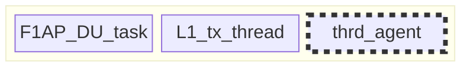
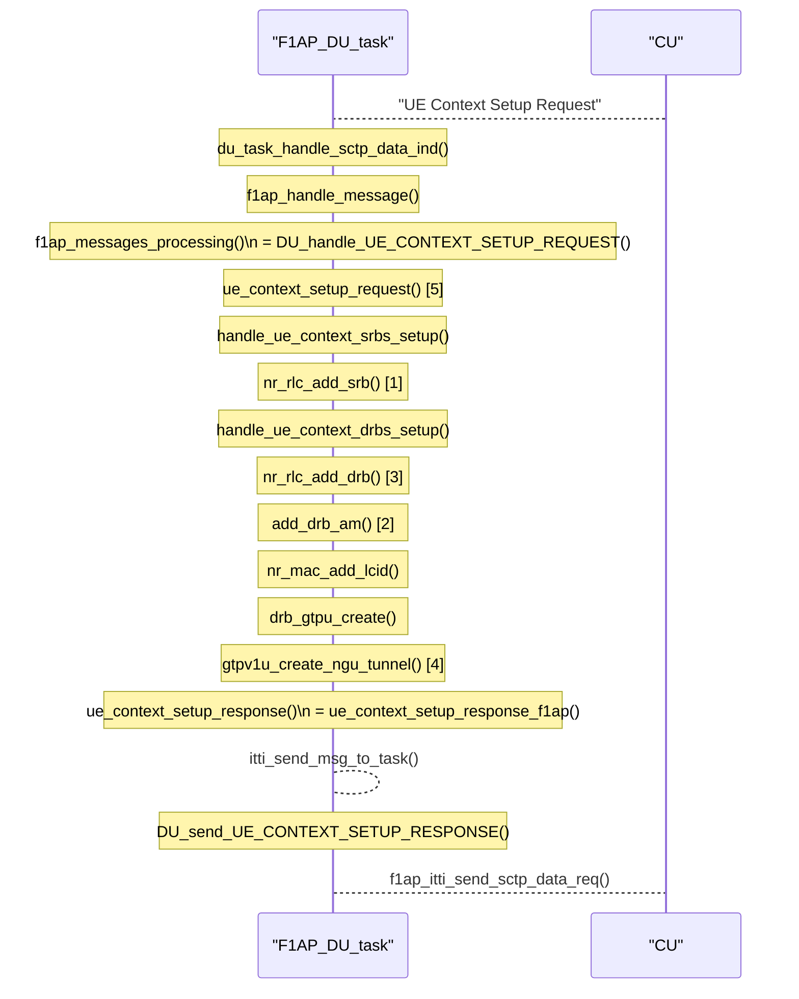
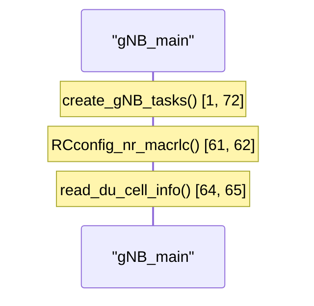
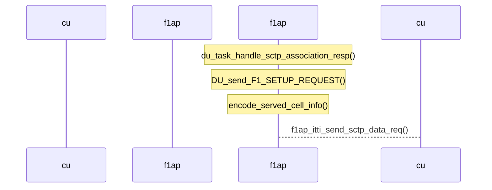
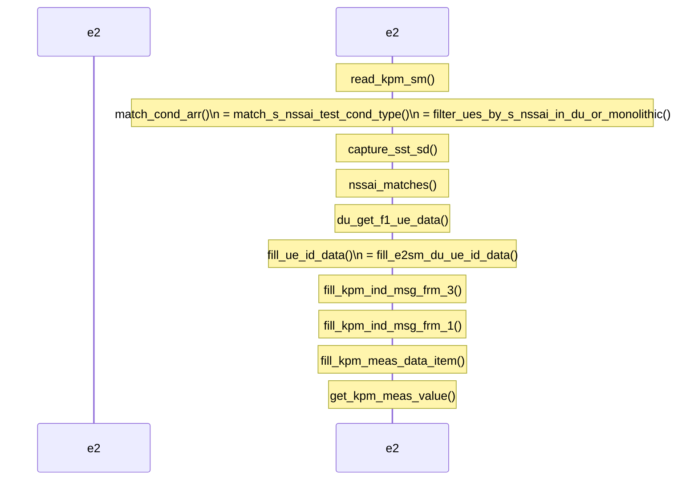

# 2024/09/26 Study Note (Define Current OAI DU High Functions & Parameters for RAN Slicing)

###### tags: `2024`


**Goal:**
- [x] [Define Current OAI DU High Functions & Parameters for RAN Slicing](#0-Summary)


 
**References:**
- [openinterface5G Gitlab](https://gitlab.eurecom.fr/oai/openairinterface5g)
- [OAI Feature Set](https://gitlab.eurecom.fr/oai/openairinterface5g/-/blob/develop/doc/FEATURE_SET.md)
- [RAN Slicing Architecture Requirements](https://github.com/bmw-ece-ntust/guideline-template/blob/wilfridAzariah/studyNotes/20240815%20Study%20Note%20(RAN%20Slicing%20Architecture%20Requirements).md)
- [Analyze what are the available in OSC and OAI for RAN slicing](https://github.com/bmw-ece-ntust/guideline-template/blob/wilfridAzariah/studyNotes/20240820%20Study%20Note%20(Analyze%20what%20are%20the%20available%20in%20OSC%20and%20OAI%20for%20RAN%20slicing).md)


**Contents:**
- [2024/09/26 Study Note (Define Current OAI DU High Functions & Parameters for RAN Slicing)](#2024-09-26-study-note--define-current-oai-du-high-functions---parameters-for-ran-slicing-)
          + [tags: `2024`](#tags---2024-)
  * [0. Summary](#0-summary)
    + [0.1. OAI DU's Entity](#01-oai-du-s-entity)
  * [1. UE Context Setup Request & Response](#1-ue-context-setup-request---response)
  * [2. Slice Configuration](#2-slice-configuration)
  * [3. Supported Slice Report to CU](#3-supported-slice-report-to-cu)
  * [4. E2SM-KPM](#4-e2sm-kpm)

<small><i><a href='http://ecotrust-canada.github.io/markdown-toc/'>Table of contents generated with markdown-toc</a></i></small>


## 0. Summary


1. DU's [slice configuration](#2-Slice-Configuration) from configuration file or O1 is stored in F1AP_DU_task database

2. [UE Context Setup Request](#1-UE-Context-Setup-Request-amp-Response) only store the slice information of each DRB but no slice have special treatment. Feature to treat each slice is not available yet

3. DU's slice configuration is reported to CU in [F1 Setup request](#3-Supported-Slice-Report-to-CU)

4. Having slice configured to the DU does not mean that the DU will treat each slice differently. In OAI's case, MAC SCH does not do anything to available slice because Slice Based Scheduler is not a feature yet.

5. [E2SM-KPM](#4-E2SM-KPM) will report UE measurements based on Slice Criteria Input

### 0.1. OAI DU's Entity


- L1_tx_thread is mainly PHY:
    - PHY will call MAC:
        - MAC will call SCH
- Dotted box only exist if E2 Agent is used




## 1. UE Context Setup Request & Response


MAC Scheduler save a UE's DRB Slice information inside `sched_ctrl->lc_config->nssai` data structure through the `nr_mac_add_lcid()` function 




Example Log
```shell=
[RLC]   Added srb 2 to UE 1
[RLC]   Added drb 1 to UE 1
[RLC]   Added DRB to UE 1
[GTPU]   [100] Created tunnel for UE ID 1, teid for incoming: , teid for outgoing  to remote IPv4: , IPv6 ::
[NR_MAC]   UE 7e3d: received capabilities, updating CellGroupConfig
[NR_MAC]   Number of DRBs = 1 and SRBs = 1
[NR_MAC]   number of QOS flows mapped to DRB_id 1: 1
[NR_MAC]   Setting NSSAI sst: 1, sd: 16777215 for DRB: 1
```


## 2. Slice Configuration


Slice Configuration for the DU is stored in `f1_inst.setup_req.cell.info.snssai` by the `read_du_cell_info()` function





Example Log
```shell=
[PHY]   create_gNB_tasks() Task ready initialize structures
[LIBCONFIG] (root): 2/2 parameters successfully set, (0 to default value)
[LIBCONFIG] gNBs.[0]: 30/30 parameters successfully set, (22 to default value)
[LIBCONFIG] list gNBs..amf_ip_address not found in config file /home/lucasgeral/openairinterface5g/f1_split/du.conf 
[LIBCONFIG] list security not found in config file /home/lucasgeral/openairinterface5g/f1_split/du.conf 
[LIBCONFIG] (root): 2/2 parameters successfully set, (0 to default value)
[LIBCONFIG] gNBs.[0]: 30/30 parameters successfully set, (22 to default value)
[NR_PHY]   PRB blacklist 
[NR_PHY]   Copying 0 blacklisted PRB to L1 context
[LIBCONFIG] L1s.[0]: 19/19 parameters successfully set, (14 to default value)
[PHY]   L1_RX_THREAD_CORE -1 (16)
[PHY]   TX_AMP = 519 (-36 dBFS)
Initializing northbound interface for L1
[PHY]   l1_north_init_gNB() RC.nb_nr_L1_inst:1
[PHY]   Installing callbacks for IF_Module - UL_indication
[PHY]   l1_north_init_gNB() RC.gNB[0] installing callbacks
[LIBCONFIG] list prs_config not found in config file /home/lucasgeral/openairinterface5g/f1_split/du.conf 
[PHY]   No prs_config configuration found..!!
[LIBCONFIG] (root): 2/2 parameters successfully set, (0 to default value)
[LIBCONFIG] gNBs.[0]: 30/30 parameters successfully set, (22 to default value)
[LIBCONFIG] MACRLCs.[0]: 34/34 parameters successfully set, (22 to default value)
[GNB_APP]   pdsch_AntennaPorts N1 1 N2 1 XP 1 pusch_AntennaPorts 1
[GNB_APP]   minTXRXTIME 6
[GNB_APP]   SIB1 TDA 1
[GNB_APP]   CSI-RS 0, SRS 0, 256 QAM may be on
[LIBCONFIG] gNBs.[0].servingCellConfigCommon.[0]: 60/60 parameters successfully set, (9 to default value)
[RRC]   Read in ServingCellConfigCommon (PhysCellId 0, ABSFREQSSB 641280, DLBand 78, ABSFREQPOINTA 640008, DLBW 106,RACH_TargetReceivedPower -96
[NR_MAC]   NR band duplex spacing is 0 KHz (nr_bandtable[37].band = 78)
[RRC]   absoluteFrequencySSB 641280 corresponds to 3619200000 Hz
[NR_MAC]   NR band duplex spacing is 0 KHz (nr_bandtable[37].band = 78)
[NR_MAC]   NR band 78, duplex mode TDD, duplex spacing = 0 KHz
[NR_MAC]   NR band duplex spacing is 0 KHz (nr_bandtable[37].band = 78)
[NR_MAC]   NR band 78, duplex mode TDD, duplex spacing = 0 KHz
[LIBCONFIG] list gNBs.[0].servingCellConfigDedicated not found in config file /home/lucasgeral/openairinterface5g/f1_split/du.conf 
[LIBCONFIG] gNBs.[0]: 30/30 parameters successfully set, (22 to default value)
[LIBCONFIG] MACRLCs.[0]: 34/34 parameters successfully set, (22 to default value)
[LIBCONFIG] list gNBs.[0].E1_INTERFACE not found in config file /home/lucasgeral/openairinterface5g/f1_split/du.conf 
[MAC]   [MAIN] Init function start:nb_nr_macrlc_inst=1
[UTIL]   Creating thread MAC_STATS with affinity -1 and priority 2
[LIBCONFIG] gNBs.[0]: 30/30 parameters successfully set, (22 to default value)
[LIBCONFIG] MACRLCs.[0]: 34/34 parameters successfully set, (22 to default value)
[LIBCONFIG] list gNBs.[0].E1_INTERFACE not found in config file /home/lucasgeral/openairinterface5g/f1_split/du.conf 
[PHY]   Installing callbacks for IF_Module - UL_indication
[NR_MAC]   Configuring common parameters from NR ServingCellConfig
[NR_MAC]   config_common() dl_BandwidthP:40
[NR_MAC]   NR band duplex spacing is 0 KHz (nr_bandtable[37].band = 78)
[NR_MAC]   config_common() dl_BandwidthP:40
[NR_MAC]   NR band duplex spacing is 0 KHz (nr_bandtable[37].band = 78)
[NR_MAC]   NR band duplex spacing is 0 KHz (nr_bandtable[37].band = 78)
[NR_MAC]   NR band 78, duplex mode TDD, duplex spacing = 0 KHz
[NR_MAC]   ssb_OffsetPointA 86, ssb_SubcarrierOffset 0
[NR_MAC]   Set RX antenna number to 1, Set TX antenna number to 1 (num ssb 1: 80000000,0)
[NR_MAC]   Setting TDD configuration period to 6
[NR_MAC]   TDD has been properly configurated
DL frequency 3619200000: band 48, UL frequency 3619200000
[PHY]   DL frequency 3619200000 Hz, UL frequency 3619200000 Hz: band 48, uldl offset 0 Hz
[PHY]   Configuring MIB for instance 0, : (Nid_cell 0,DL freq 3619200000, UL freq 3619200000)
[PHY]   Initializing frame parms for mu 1, N_RB 106, Ncp 0
[PHY]   Init: N_RB_DL 106, first_carrier_offset 1412, nb_prefix_samples 144,nb_prefix_samples0 176, ofdm_symbol_size 2048
[PHY]   gNB 0 configured
[NR_MAC]   PUSCH Target 150, PUCCH Target 200, PUCCH Failure 10, PUSCH Failure 10
Configuring F1 interfaces for MACRLC
[LIBCONFIG] (root): 2/2 parameters successfully set, (0 to default value)
[LIBCONFIG] gNBs.[0]: 30/30 parameters successfully set, (22 to default value)
[LIBCONFIG] gNBs.[0].plmn_list.[0]: 3/3 parameters successfully set, (0 to default value)
[GNB_APP]   no slices transported via F1 Setup Request!
[NR_RRC]   SIB1 freq: offsetToPointA 86
[NR_MAC]   NR band duplex spacing is 0 KHz (nr_bandtable[37].band = 78)
[NR_MAC]   NR band 78, duplex mode TDD, duplex spacing = 0 KHz
[GNB_APP]   F1AP: gNB idx 0 gNB_DU_id 3584, gNB_DU_name gNB-Eurecom-DU, TAC 1 MCC/MNC/length 1/1/2 cellID 12345678
[GNB_APP]   ngran_DU: Configuring Cell 0 for TDD
[PHY]   create_gNB_tasks() RC.nb_nr_L1_inst:1
```


## 3. Supported Slice Report to CU


DU's Supported Slice Report to the CU is done in `F1 Setup Request`. Here are some important notes:
- Upon f1ap receive sctp communication up, f1ap will trigger `F1 Setup Request`




Example Log
```shell=
[F1AP]   DU Task Received SCTP_NEW_ASSOCIATION_RESP for instance 0: sending SCTP messages via assoc_id 0
```


## 4. E2SM-KPM


Based on OAI's E2 Agent [Documentation](https://gitlab.eurecom.fr/oai/openairinterface5g/-/tree/develop/openair2/E2AP?ref_type=heads#311-e2sm-kpm):
3.1.1 E2SM-KPM
As mentioned in section 2.1.2 Build OAI with E2 Agent, we support KPM v2.03/v3.00. Uses ASN.1 encoding.
Per O-RAN specifications, 5G measurements supported by KPM are specified in 3GPP TS 28.552.
From 3GPP TS 28.552, we support the following list:
- "DRB.PdcpSduVolumeDL"
- "DRB.PdcpSduVolumeUL"
- "DRB.RlcSduDelayDl"
- "DRB.UEThpDl"
- "DRB.UEThpUl"
- "RRU.PrbTotDl"
- "RRU.PrbTotUl"

From O-RAN.WG3.E2SM-KPM-version specification, we implemented:
- REPORT Service Style 4 ("Common condition-based, UE-level" - section 7.4.5) - fetch above measurements per each UE that matches common criteria (e.g. S-NSSAI).



