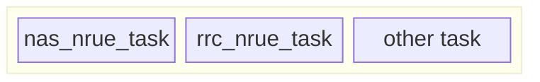
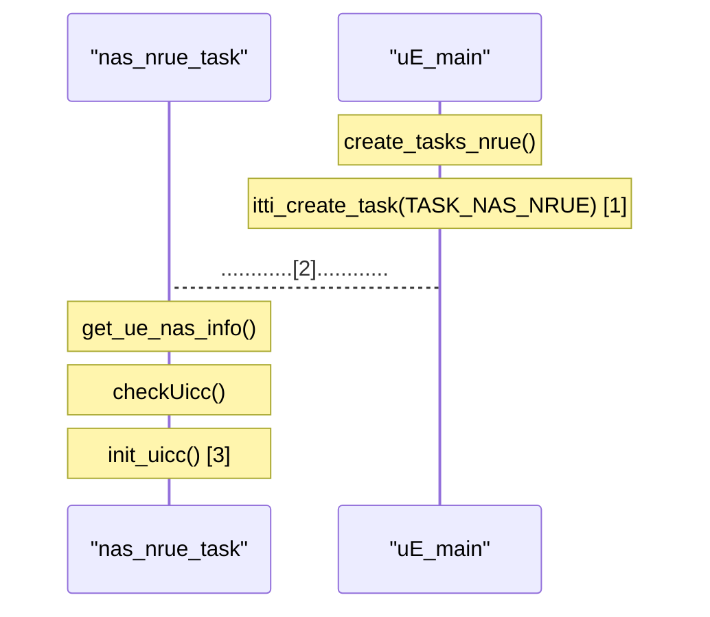
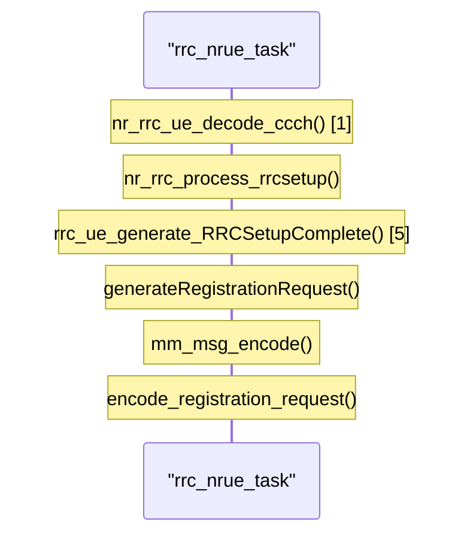
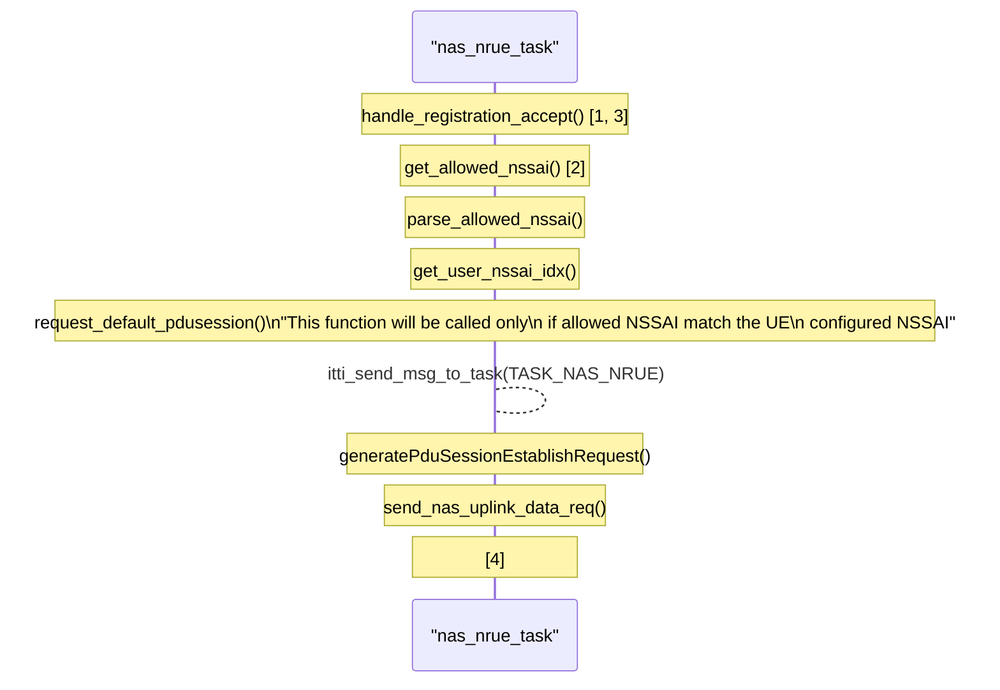

# 2024/09/30 Study Note (Define Current OAI UE Functions & Parameters for RAN Slicing)

###### tags: `2024`


**Goal:**
- [x] [Define Current OAI UE Functions & Parameters for RAN Slicing](#0-Summary)


 
**References:**
- [openinterface5G Gitlab](https://gitlab.eurecom.fr/oai/openairinterface5g)
- [OAI Feature Set](https://gitlab.eurecom.fr/oai/openairinterface5g/-/blob/develop/doc/FEATURE_SET.md)
- [RAN Slicing Architecture Requirements](https://github.com/bmw-ece-ntust/guideline-template/blob/wilfridAzariah/studyNotes/20240815%20Study%20Note%20(RAN%20Slicing%20Architecture%20Requirements).md)
- [Analyze what are the available in OSC and OAI for RAN slicing](https://github.com/bmw-ece-ntust/guideline-template/blob/wilfridAzariah/studyNotes/20240820%20Study%20Note%20(Analyze%20what%20are%20the%20available%20in%20OSC%20and%20OAI%20for%20RAN%20slicing).md)


**Contents:**
- [2024/09/30 Study Note (Define Current OAI UE Functions & Parameters for RAN Slicing)](#2024-09-30-study-note--define-current-oai-ue-functions---parameters-for-ran-slicing-)
          + [tags: `2024`](#tags---2024-)
  * [0. Summary](#0-summary)
    + [0.1. OAI UE's Entity](#01-oai-ue-s-entity)
  * [1. Slice Configuration](#1-slice-configuration)
  * [2. Requested Slice to CN](#2-requested-slice-to-cn)
    + [2.1. `encode_registration_request()` function](#21--encode-registration-request----function)
  * [3. Allowed Slice from CN](#3-allowed-slice-from-cn)

<small><i><a href='http://ecotrust-canada.github.io/markdown-toc/'>Table of contents generated with markdown-toc</a></i></small>


## 0. Summary


1. [Slice Configuration](#1-Slice-Configuration) from configuration file for the UE is stored. Not used for Requsted NSSAI, but used to crosscheck allowed NSSAI before sending PDU Session Establishment Request
2. [Allowed Slice from Core Network](#3-Allowed-Slice-from-CN) is used to determine PDU session slice after crosscheck with config file slice

### 0.1. OAI UE's Entity



## 1. Slice Configuration


- Slice Configuration for the UE is stored in `nr_ue_nas[].uicc.nssai_sst & nssai_sd` by the `init_uicc()` function
- **Important**: this configuration is not used to request the slice of OAI UE but is used to check UE slice before sending PDU Session Establishment Request. OAI UE used slice from [Allowed Slice from CN](#3-Allowed-Slice-from-CN) after checking first with its slice configuration





Example Log
```shell=
[UTIL]   threadCreate() for TASK_NAS_NRUE: creating thread with affinity ffffffff, priority 50
[ITTI]   Created Posix thread TASK_NAS_NRUE
[SIM]   UICC simulation: IMSI=001010000000001, IMEISV=6754567890123413, Ki=fec86ba6eb707ed08905757b1bb44b8f, OPc=c42449363bbad02b66d16bc975d77cc1, DNN=oai, SST=0x01, SD=0xffffff
```


## 2. Requested Slice to CN


- No function in OAI UE's registration request related to Requested NSSAI. Prove can be seen from [`encode_registration_request()` function](#21-encode_registration_request-function) where only `REGISTRATION_REQUEST_5GMM_CAPABILITY_IEI` and `REGISTRATION_REQUEST_UE_SECURITY_CAPABILITY_IEI` are included in `REGISTRATION_REQUEST`. `REGISTRATION_REQUEST` optionally can include (see 3GPP TS 24.501 for reference):
    - 5GMM capability
    - UE security capability
    - Requested NSSAI
    - etc




Example Log
```shell=
[0m[NR_RRC]   [UE0][RAPROC] Logical Channel DL-CCCH (SRB0), Received NR_RRCSetup
[0m[RLC]   Added srb 1 to UE 0
[0m[MAC]   Applying CellGroupConfig from gNodeB
[0m[NR_RRC]   State = NR_RRC_CONNECTED
[0m[NR_RRC]   [UE 0][RAPROC] Logical Channel UL-DCCH (SRB1), Generating RRCSetupComplete (bytes33)
```


### 2.1. `encode_registration_request()` function

```c=
int encode_registration_request(registration_request_msg *registration_request, uint8_t *buffer, uint32_t len)
{
  int encoded = 0;
  int encode_result = 0;

  *(buffer + encoded) = ((encode_u8_nas_key_set_identifier(&registration_request->naskeysetidentifier) & 0x0f) << 4) | (encode_5gs_registration_type(&registration_request->fgsregistrationtype) & 0x0f);
  encoded++;

  if ((encode_result =
         encode_5gs_mobile_identity(&registration_request->fgsmobileidentity, 0, buffer +
                                    encoded, len - encoded)) < 0)        //Return in case of error
    return encode_result;
  else
    encoded += encode_result;

  if ((registration_request->presencemask & REGISTRATION_REQUEST_5GMM_CAPABILITY_PRESENT)
      == REGISTRATION_REQUEST_5GMM_CAPABILITY_PRESENT) {
    if ((encode_result = encode_5gmm_capability(&registration_request->fgmmcapability,
                         REGISTRATION_REQUEST_5GMM_CAPABILITY_IEI, buffer + encoded, len -
                         encoded)) < 0)
      // Return in case of error
      return encode_result;
    else
      encoded += encode_result;
  }

  if ((registration_request->presencemask & REGISTRATION_REQUEST_UE_SECURITY_CAPABILITY_PRESENT)
      == REGISTRATION_REQUEST_UE_SECURITY_CAPABILITY_PRESENT) {
    if ((encode_result = encode_nrue_security_capability(&registration_request->nruesecuritycapability,
                         REGISTRATION_REQUEST_UE_SECURITY_CAPABILITY_IEI, buffer + encoded, len -
                         encoded)) < 0)
      // Return in case of error
      return encode_result;
    else
      encoded += encode_result;
  }


  // TODO, Encoding optional fields
  return encoded;
}
```

## 3. Allowed Slice from CN


- Allowed NSSAI for the UE is stored in `nas_allowed_nssai` by `parse_allowed_nssai()`
- This allowed slice is the used for PDU Session Establishment Request in `generatePduSessionEstablishRequest()` after check the value with configuration file slice setting in `get_user_nssai_idx()`




Example Log
```shell=
[0m[NAS]   [UE] Received REGISTRATION ACCEPT message
[0m[NAS]   This NAS IEI is not handled when extracting list of allowed NSSAI
[0m[NAS]   Send NAS_UPLINK_DATA_REQ message(RegistrationComplete)
[0m[NAS]   Send NAS_UPLINK_DATA_REQ message(PduSessionEstablishRequest)
```


