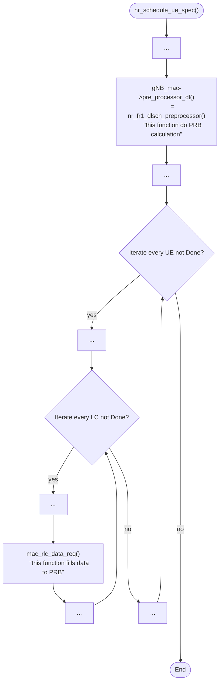

# 2024/11/08 Study Note (NEU ORANSlice MAC SCH details)

###### tags: `2024`


**Goal:**
- [ ] Find the difference between NEU MAC SCH with default OAI MAC SCH


**References:**
- [Wilfrid | ORANSlice: An Open-Source 5G Network Slicing Platform for O-RAN](https://github.com/bmw-ece-ntust/guideline-template/blob/wilfridAzariah/studyNotes/20241023%20Study%20Note%20(ORANSlice%20An%20Open-Source%205G%20Network%20Slicing%20Platform%20for%20O-RAN).md#2-what-they-add-in-oai-nrue)
- ORANSlice: An Open-Source 5G Network Slicing Platform for O-RAN
- https://github.com/wineslab/ORANSlice
- https://gitlab.eurecom.fr/oai/openairinterface5g/-/blob/develop/doc/MAC/mac-usage.md?ref_type=heads
- https://gitlab.eurecom.fr/oai/openairinterface5g/-/blob/develop/doc/SW_archi.md?ref_type=heads


**Table of Contents:**
- [2024/11/08 Study Note (NEU ORANSlice MAC SCH details)](#2024-11-08-study-note--neu-oranslice-mac-sch-details-)
          + [tags: `2024`](#tags---2024-)
  * [0. Summary](#0-summary)
  * [1. Clues from Documents](#1-clues-from-documents)
  * [1.1. ORANSlice Paper](#11-oranslice-paper)
  * [1.2. OAI Software Archi Documentation](#12-oai-software-archi-documentation)
  * [2. Regular OAI MAC PF Scheduler Flow](#2-regular-oai-mac-pf-scheduler-flow)
    + [2.1. `gNB_dlsch_ulsch_scheduler()`](#21-gnb_dlsch_ulsch_scheduler)
    + [2.2. `nr_schedule_ue_spec()`](#22-nr_schedule_ue_spec)
    + [2.3. `nr_fr1_dlsch_preprocessor()`](#23-nr_fr1_dlsch_preprocessor)
    + [2.4. `pf_dl()`](#24-pf_dl)
  * [3. RRM Policy based OAI MAC PF Scheduler Flow](#3-rrm-policy-based-oai-mac-pf-scheduler-flow)
    + [3.1. `nr_fr1_dlsch_preprocessor()`](#31-nr_fr1_dlsch_preprocessor)
    + [3.2. `dl_sched_unit()`](#32-dl_sched_unit)
    + [3.3. `pf_dl_slice()`](#33-pf_dl_slice)
  * [4. NVS RRM Policy based OAI MAC SCH Flow](#4-nvs-rrm-policy-based-oai-mac-sch-flow)
    + [4.1. `nr_schedule_ue_spec()`](#41-nr_schedule_ue_spec)
    + [4.2. `nvs_nr_dl()`](#42-nvs_nr_dl)
    + [4.3. `nr_pf_dl()`](#43-nr_pf_dl)

<small><i><a href='http://ecotrust-canada.github.io/markdown-toc/'>Table of contents generated with markdown-toc</a></i></small>


## 0. Summary

abc

## 1. Clues from Documents

## 1.1. ORANSlice Paper

- ORANSlice extends the proportional-fair scheduler of OAI to integrate the slice-aware scheme described above. As we will describe later, this is achieved by implementing a two-tier resource allocation mechanism that considers: **(i) inter-slice resource allocation** and sharing according to RAN slicing policies, which will be elaborated in Section 3.2; and **(ii) intra-slice resource allocation** to schedule transmissions for all UEs that belong to the same slices.

## 1.2. OAI Software Archi Documentation

- calls preprocessor via pre_processor_dl(): the preprocessor is responsible for allocating CCEs and PUCCH (using allocate_nr_CCEs() and nr_acknack_scheduling()) and deciding on the frequency/time domain allocation including the TB size. What it typically does:
    1. Check available resources in the vrb_map
    2. Checks the quantity of waiting data in RLC
    3. Either set up resource allocation directly (e.g., for a single UE, phytest), or call into a function to perform actual resource allocation. Currently, this is done using pf_dl() which implements a basic proportional fair scheduler:
        - for every UE, check for retransmission and allocate as necessary
        - Calculate the PF coefficient and put eligible UEs into a list
        - Allocate resources to the UE(s) with the highest coefficient
    4. Mark taken resources in the vrb_map

## 2. Regular OAI MAC PF Scheduler Flow

### 2.1. `gNB_dlsch_ulsch_scheduler()`


### 2.2. `nr_schedule_ue_spec()`



### 2.3. `nr_fr1_dlsch_preprocessor()`

```flow
st=>start: nr_fr1_dlsch_preprocessor()
e=>end: End
op=>operation: ...
op2=>operation: pf_dl()
[this function do PRB calculation]
op3=>operation: ...

st->op->op2->op3->e
```

### 2.4. `pf_dl()`

```flow
st=>start: pf_dl()
e=>end: End
op=>operation: ...
op2=>operation: [this part is for retransmission]
op3=>operation: ...
cond=>condition: Iterate every UE not Done?
op4=>operation: ...
op5=>operation: nr_find_nb_rb()
[count RB needed for the TB size from RLC]
op6=>operation: ...


st->op->op2->op3->cond
cond(yes)->op4
cond(no)->e
op4->op5->op6->cond
```

## 3. RRM Policy based OAI MAC PF Scheduler Flow

### 3.1. `nr_fr1_dlsch_preprocessor()`

```flow
st=>start: nr_fr1_dlsch_preprocessor()
e=>end: End
op=>operation: ...
op2=>operation: nr_store_dl_slice_info()
op3=>operation: nr_get_ue_active_slice_list()
op4=>operation: nr_store_dlsch_buffer()
op5=>operation: nr_slice_preprocess()
op6=>operation: nr_slice_prb_estimate()
op7=>operation: qsort()
op8=>operation: dl_sched_unit()
[do allocation for inter slice]

st->op->op2->op3->op4->op5->op6->op7->op8->e
```

### 3.2. `dl_sched_unit()`

```flow
st=>start: dl_sched_unit()
e=>end: End
op=>operation: ...
op2=>operation: [this part is for retransmission]
op3=>operation: ...
op4=>operation: [get every slice rrmPolicy]
cond=>condition: Iterate every Slice not Done?
op5=>operation: ...
op6=>operation: pf_dl_slice()
[do allocation for intra slice]
op7=>operation: ...


st->op->op2->op3->op4->cond
cond(yes)->op5
cond(no)->e
op5->op6->op7->cond
```

### 3.3. `pf_dl_slice()`

```flow
st=>start: pf_dl_slice()()
e=>end: End
op=>operation: ...
cond=>condition: Iterate every UE not Done?
op2=>operation: ...
op3=>operation: [calculate UE coeff for PF]
op4=>operation: ...
op5=>operation: ...
cond2=>condition: Iterate every UE not Done?
op6=>operation: ...
op7=>operation: nr_find_nb_rb()
[count RB needed for the TB size from RLC]
op8=>operation: ...


st->op->cond
cond(yes)->op2
cond(no)->op5
op2->op3->op4->cond
op5->cond2
cond2(yes)->op6
cond2(no)->e
op6->op7->op8->cond2
```

## 4. NVS RRM Policy based OAI MAC SCH Flow


### 4.1. `nr_schedule_ue_spec()`

```flow
st=>start: nr_schedule_ue_spec()
e=>end: End
op=>operation: ...
op2=>operation: gNB_mac->pre_processor_dl.dl()
= nvs_nr_dl()
[this function do PRB calculation]
op3=>operation: ...
cond=>condition: Iterate every UE not Done?
op4=>operation: ...
cond2=>condition: Iterate every LC not Done?
op5=>operation: ...
op6=>operation: mac_rlc_data_req()
[this function fills data to PRB]
op7=>operation: ...
op8=>operation: ...

st->op->op2->op3->cond
cond(yes)->op4
cond(no)->e
op4->cond2
cond2(yes)->op5
cond2(no)->op8
op5->op6->op7->cond2
op8->cond
```

### 4.2. `nvs_nr_dl()`

```flow
st=>start: nvs_nr_dl()
e=>end: End
op=>operation: ...
op2=>operation: [this part will check which slice to schedule for this tti/slot]
op3=>operation: ...
op4=>operation: si->s[selected slice id]->dl_algo.run
= nr_proportional_fair_wbcqi_dl.run()
= nr_pf_dl()
op5=>operation: ...

st->op->op2->op3->op4->op5->e
```

### 4.3. `nr_pf_dl()`

```flow
st=>start: nr_pf_dl()
e=>end: End
op=>operation: ...
op2=>operation: [this part is for retransmission]
op3=>operation: ...
cond=>condition: Iterate every UE not Done?
op4=>operation: ...
op5=>operation: nr_find_nb_rb()
[count RB needed for the TB size from RLC]
op6=>operation: ...


st->op->op2->op3->cond
cond(yes)->op4
cond(no)->e
op4->op5->op6->cond
```