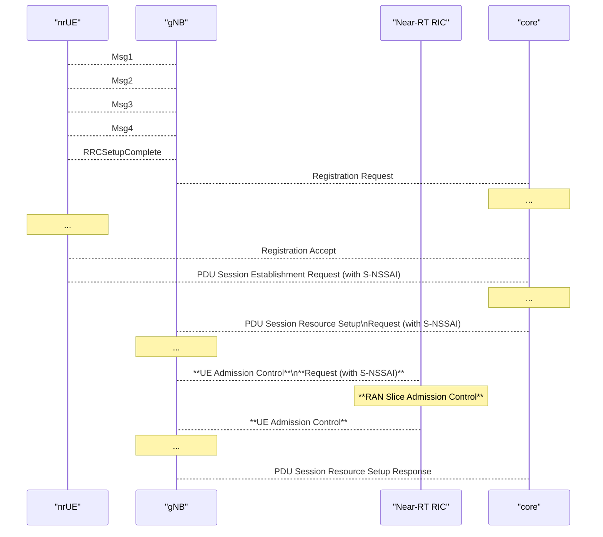
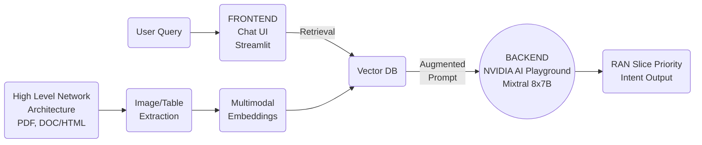
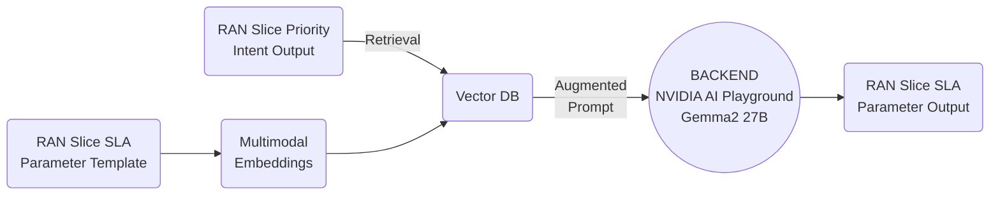

# 2025/01/09 Study Note (RAN Slicing's Thesis Problem Definition - RAN Slicing Related Topics 3)

###### tags: `2025`

**Goal:**
- [ ] Write [research proposal for LLM to Enhance Intent-Based Network Management Automation for On-Demand RAN Slice Admission Control](#1-Research-Proposal-1-LLM-to-Enhance-Intent-Based-Network-Management-Automation-for-On-Demand-RAN-Slice-Admission-Control)

**References:**
- [Prof. Ray | Template for BMW Lab.](https://hackmd.io/@RayCheng/rJIuoWmB8)
- [Wilfrid's Thesis Problem Definition - RAN Slicing Architecture](https://hackmd.io/@superwilfrid/BJaSZiYjA)
- [RAN Slicing's Thesis Problem Definition - RAN Slicing Related Topics](https://hackmd.io/@superwilfrid/SJD6D_ajR)
- [RAN Slicing's Thesis Problem Definition - RAN Slicing Related Topics 2](https://github.com/bmw-ece-ntust/guideline-template/blob/wilfridAzariah/studyNotes/20241217%20Study%20Note%20(RAN%20Slicing's%20Thesis%20Problem%20Definition%20-%20RAN%20Slicing%20Related%20Topics%202).md)

**Table of Contents:**
[[_TOC_]]

## 1. Research Proposal 1 (LLM to Enable Intent-Based Network Management Automation for On-Demand RAN Slice Admission Control)

### 1.1. Research Proposal

References:
1. [5G Slicing for Emergency Communications](https://ieeexplore.ieee.org/document/9732142)
2. [A unified machine learning approach to time series forecasting applied to demand at emergency departments](https://bmcemergmed.biomedcentral.com/articles/10.1186/s12873-020-00395-y)
3. [A Survey on Large Language Models for Network Operations & Management: Applications, Techniques, and Opportunities](https://arxiv.org/html/2412.19823v1)
4. O-RAN.WG1.Use-Cases-Detailed-Specification

- **Contribution:**
    - Develop a platform for testing Slice Aware Admission Control using OSC (Near-RT RIC) and OAI (gNB) source code
    - ~~Develop an LLM model to translate natural language to RAN Slice SLA Parameter~~
- **Background:**
    - ~~An important area that can potentially benefit from 5G slicing is emergency communications [1]~~
    - ~~Although predictive models leveraging machine learning and time-series analysis have been proposed to forecast emergency service demand, they still exhibit significant forecasting errors, often exceeding a 5% margin [2].~~
    - LLM can enable intent-based networking (IBN), where operators define high-level goals in natural language, and the system autonomously translates these intents into actionable configurations and policies [3]
- **Intended Outcome:**
    - ~~To provide a proof of concept of flexible, on-demand (priority) service management automation enhanced using AI<br>(translate = Yes, you can use chatGPT to speed up your network management automation)~~
- **Application Design:**
    - ~~RAN Slice Admission Control Policy:~~
        - ~~User request prioritation to LLM~~
        - ~~LLM convert user text to RAN Slice SLA Parameter~~
        - ~~RAN Slice Admission Control rApp send A1 Policy to Near-RT RIC~~
    - RAN Slice Admission Control Loop
        - OAI nrUE send PDU Session Establishment Request to CN
        - CN send PDU Session Resource Setup Request to OAI gNB
        - OAI gNB perform request UE Admission Control to Near-RT RIC
        - RAN Slice Admission Control xApp pass Accept/Reject decision to OAI gNB
        - OAI gNB reply PDU Session Resource Setup Response to CN
- **Findings:**
    - For future study
- **Challenge:**
    - No verification platform for Slice Aware Admission Control mechanism validation
    - ~~Lack of LLM model to translate natural language to RAN Slice SLA Parameter~~

### 1.2. System Model/Architecture
References:
1. [Juniper RAN Intelligent Controller - Admission Control Use Case](https://www.youtube.com/watch?v=HD3kDIp0VZI)
2. Yueh Huan's Thesis Oral Exam PPT
3. [Multimodal RAG Assistant with NVIDIA NeMo](https://github.com/NVIDIA/GenerativeAIExamples/tree/main/community/multimodal_assistant)

- System architecture:


- Admission Control Loop Flow diagram:


- Intent Handler architecture:
    - Natural Language Intent Handler

- RAN Slice Intent Handler


- Key Parameters:
    - E2:
        - Insert Service Style 4: Radio Access Control Request:
            - UE Admission Control Request:
                - UE ID
                - List of PDU sessions for admission:
                    - PDU Session ID
                    - S-NSSAI
        - Control Service Style 4: Radio Access Control:
            - UE Admission Control:
                - UE ID
                - RIC Control Decision
    - A1:
        - SliceSLATarget
            - sliceId
            - maxNumberOfUes

### 1.3. Scenarios for Experiments

References:
1. [Intent-Based Management of Next-Generation Networks: an LLM-Centric Approach](https://ieeexplore.ieee.org/document/10574890)

| Scenario         | Goal        | Figures                                             | Expected Result                                                     |
| ---------------- | ----------- | --------------------------------------------------- | ------------------------------------------------------------------- |
| ~~Scenario 1~~   | ~~Problem~~ |  | ~~If system is like this, On-Demand Network Management is tedious~~ |
| ~~Scenario 2-1~~ | ~~Novelty~~ |  | ~~On-demand Intent to Slice Admission Control Policy Conversion~~   |
| ~~Scenario 2-2~~ | ~~Novelty~~ |  | ~~Network Management Automation~~                                   |
| Scenario 2-2     | Novelty     |  | Admission Control can guarantee throughput of Priority Slice        |
| Scenario 3       | Price Paid  |                                                     | Show LLM resource usage?                                                                    |

<!--
```c=
{
    "SliceSLATarget": [
        {
            "sliceId": "1:0x010203",
            "maxNumberOfUes": "5"
        },
        {
            "sliceId": "1:0x112233",
            "maxNumberOfUes": "5"
        }
    ]
}
```
-->

