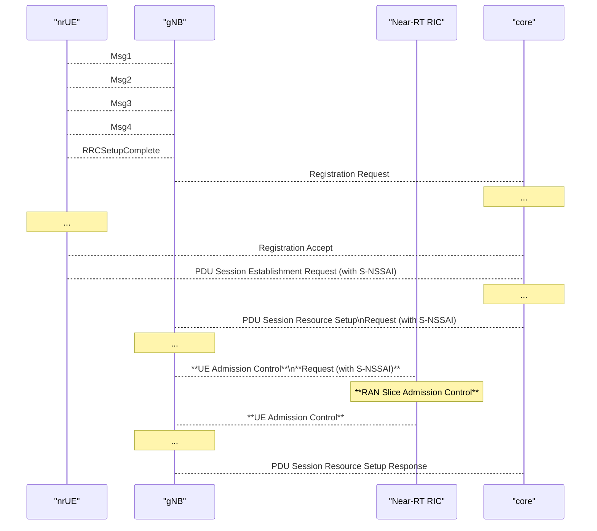
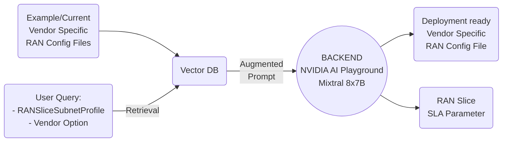

# 2025/01/17 Study Note (RAN Slicing's Thesis Problem Definition - RAN Slicing Related Topics 4)

###### tags: `2025`

**Goal:**
- [x] Write research proposal for [LLM to Enable Vendor Specific Configuration File and RAN Slice SLA Parameter Generation for On-Demand RAN Slice Creation and Admission Control](#1-Research-Proposal-1-LLM-to-Enable-Vendor-Specific-Configuration-File-and-RAN-Slice-SLA-Parameter-Generation-for-On-Demand-RAN-Slice-Creation-and-Admission-Control)

**References:**
- [Prof. Ray | Template for BMW Lab.](https://hackmd.io/@RayCheng/rJIuoWmB8)
- [Wilfrid's Thesis Problem Definition - RAN Slicing Architecture](https://github.com/bmw-ece-ntust/guideline-template/blob/wilfridAzariah/studyNotes/20240826%20Study%20Note%20(Wilfrid's%20Thesis%20Problem%20Definition%20-%20RAN%20Slicing%20Architecture).md)
- [RAN Slicing's Thesis Problem Definition - RAN Slicing Related Topics](https://github.com/bmw-ece-ntust/guideline-template/blob/wilfridAzariah/studyNotes/20240829%20Study%20Note%20(RAN%20Slicing's%20Thesis%20Problem%20Definition%20-%20RAN%20Slicing%20Related%20Topics).md)
- [RAN Slicing's Thesis Problem Definition - RAN Slicing Related Topics 2](https://github.com/bmw-ece-ntust/guideline-template/blob/wilfridAzariah/studyNotes/20241217%20Study%20Note%20(RAN%20Slicing's%20Thesis%20Problem%20Definition%20-%20RAN%20Slicing%20Related%20Topics%202).md)
- [RAN Slicing's Thesis Problem Definition - RAN Slicing Related Topics 3](https://github.com/bmw-ece-ntust/guideline-template/blob/wilfridAzariah/studyNotes/20250109%20Study%20Note%20(RAN%20Slicing's%20Thesis%20Problem%20Definition%20-%20RAN%20Slicing%20Related%20Topics%203).md)

**Table of Contents:**
- [2025/01/17 Study Note (RAN Slicing's Thesis Problem Definition - RAN Slicing Related Topics 4)](#2025-01-17-study-note--ran-slicing-s-thesis-problem-definition---ran-slicing-related-topics-4-)
          + [tags: `2025`](#tags---2025-)
  * [1. Research Proposal 1 (LLM to Enable Vendor Specific Configuration File and RAN Slice SLA Parameter Generation for On-Demand RAN Slice Creation and Admission Control)](#1-research-proposal-1--llm-to-enable-vendor-specific-configuration-file-and-ran-slice-sla-parameter-generation-for-on-demand-ran-slice-creation-and-admission-control-)
    + [1.1. Research Proposal](#11-research-proposal)
    + [1.2. System Model/Architecture](#12-system-model-architecture)
    + [1.3. Scenarios for Experiments](#13-scenarios-for-experiments)
  * [2. Appendix](#2-appendix)
    + [2.1. General Example of Network Slicing Management Functions](#21-general-example-of-network-slicing-management-functions)
    + [2.2. Lifecycle Phases of an NSI](#22-lifecycle-phases-of-an-nsi)
    + [2.3. Schematic overview of the generic framework of a Network Slice/Subnet design process](#23-schematic-overview-of-the-generic-framework-of-a-network-slice-subnet-design-process)
    + [2.4. Redraw](#24-redraw)
    + [2.9. Extras](#29-extras)
      - [2.9.1.](#291)
      - [2.9.2. RANSliceSubnetProfile](#292-ranslicesubnetprofile)

<small><i><a href='http://ecotrust-canada.github.io/markdown-toc/'>Table of contents generated with markdown-toc</a></i></small>

## 1. Research Proposal 1 (LLM to Enable Vendor Specific Configuration File and RAN Slice SLA Parameter Generation for On-Demand RAN Slice Creation and Admission Control)

### 1.1. Research Proposal

References:
1. [Comprehensive Tutorial on the Organization of a Standards-Aligned Network Slice/Subnet Design Process and Opportunities for Its Automation](https://ieeexplore.ieee.org/abstract/document/10375939)
2. [A Survey on Large Language Models for Network Operations & Management: Applications, Techniques, and Opportunities](https://arxiv.org/html/2412.19823v1)
3. [Digital Twins for 5G Networks: A Modeling and Deployment Methodology](https://ieeexplore.ieee.org/document/10103508)
4. O-RAN.WG1.Use-Cases-Detailed-Specification

- **Contribution:**
    - Develop a platform for testing Slice Aware Admission Control using OSC (Near-RT RIC) and OAI (gNB) source code
    - Develop an LLM model to translate RANSliceProfile to Vendor Specific Config File and A1 Policy
- **Background:**
    - Service-Level Agreement/Specification (SLA/SLS) requirements are challenging. It is because they put special expectations against the orchestration systems which must be capable of inferring the low-level, technical details of the NSI/NSSI to be deployed [1]
    - LLM can enable intent-based networking (IBN), where operators define high-level goals in natural language, and the system autonomously translates these intents into actionable configurations and policies [2]
    - Digital Twins provide a cost-effective way to evaluate performance, predict the effects of network changes, optimize network management, and make appropriate decisions [3]
- **Intended Outcome:**
    - To provide a proof of concept of flexible, vendor specific RAN configuration file and A1 Policy generation enabled using AI<br>(translate = Yes, you can use chatGPT to create your gNB's config file and A1 Policy)
- **Application Design:**
    - RAN Slice Config File and Admission Control Policy Generation:
        - NSMF request RANSliceProfile to LLM
        - LLM convert RANSliceProfile to Vendor Specific Config File and A1 Policy containing SLA parameter
        - RAN Slice Admission Control rApp send A1 Policy to Near-RT RIC
    - RAN Slice Admission Control Loop
        - OAI nrUE send PDU Session Establishment Request to CN
        - CN send PDU Session Resource Setup Request to OAI gNB
        - OAI gNB perform request UE Admission Control to Near-RT RIC
        - RAN Slice Admission Control xApp pass Accept/Reject decision to OAI gNB
        - OAI gNB reply PDU Session Resource Setup Response to CN
- **Findings:**
    - For future study
- **Challenge:**
    - No verification platform for Slice Aware Admission Control mechanism validation
    - No LLM model to translate RANSliceProfile to Vendor Specific Config File and A1 Policy


### 1.2. System Model/Architecture
References:
1. [Juniper RAN Intelligent Controller - Admission Control Use Case](https://www.youtube.com/watch?v=HD3kDIp0VZI)
2. Yueh Huan's Thesis Oral Exam PPT
3. [Multimodal RAG Assistant with NVIDIA NeMo](https://github.com/NVIDIA/GenerativeAIExamples/tree/main/community/multimodal_assistant)

- System architecture:


- Admission Control Loop Flow diagram:


- RANSliceSubnetProfile Translator Architecture


- Key Parameters:
    - E2:
        - Insert Service Style 4: Radio Access Control Request:
            - UE Admission Control Request:
                - UE ID
                - List of PDU sessions for admission:
                    - PDU Session ID
                    - S-NSSAI
        - Control Service Style 4: Radio Access Control:
            - UE Admission Control:
                - UE ID
                - RIC Control Decision
    - A1:
        - SliceSLATarget
            - sliceId
            - maxNumberOfUes

### 1.3. Scenarios for Experiments

References:
1. [Intent-Based Management of Next-Generation Networks: an LLM-Centric Approach](https://ieeexplore.ieee.org/document/10574890)

| Scenario     | Goal       | Figures                                             | Expected Result                                                                                                  |
| ------------ | ---------- | --------------------------------------------------- | ---------------------------------------------------------------------------------------------------------------- |
| Scenario 1   | Problem    |  | In RAN NSSI Level, Process from SliceProfile Request to Deployable Config File and A1 Policy Creation is tedious |
| Scenario 2-1 | Novelty    |  | Use LLM to speed up SliceProfile to Config File and A1 Policy Translation                                        |
| Scenario 2-2 | Novelty    |  | Network Management Automation                                                                                    |
| Scenario 2-3 | Novelty    |  | Admission Control can guarantee throughput of Priority Slice                                                     |
| Scenario 3   | Price Paid |  | Amount of Adjustment/Complexity from Using LLM is less than using programatic way                                |:::

## 2. Appendix

### 2.1. General Example of Network Slicing Management Functions

References:
1. 3GPP TR 128 801 Study on Management and Orchestration of Network Slicing for Next Generation Network
2. GSMA NG 116 Generic Network Slice Template


### 2.2. Lifecycle Phases of an NSI

1. 3GPP TR 128 801 Study on Management and Orchestration of Network Slicing for Next Generation Network


### 2.3. Schematic overview of the generic framework of a Network Slice/Subnet design process

1. [Comprehensive Tutorial on the Organization of a Standards-Aligned Network Slice/Subnet Design Process and Opportunities for Its Automation](https://ieeexplore.ieee.org/abstract/document/10375939)


### 2.4. Redraw


### 2.9. Extras

#### 2.9.1.

Reference: O-RAN.WG2.A1TD

```c=
{
    "SliceSLATarget": [
        {
            "sliceId": "1:0x010203",
            "maxNumberOfUes": "5"
        },
        {
            "sliceId": "1:0x112233",
            "maxNumberOfUes": "5"
        }
    ]
}
```


#### 2.9.2. RANSliceSubnetProfile

Reference: 3GPP TS 28.541

```json=
RANSliceSubnetProfile:
    type: object
    properties:
        maxNumberOfUEs: 500
        dLThptPerUE:
            guaThpt: 1,000
```


