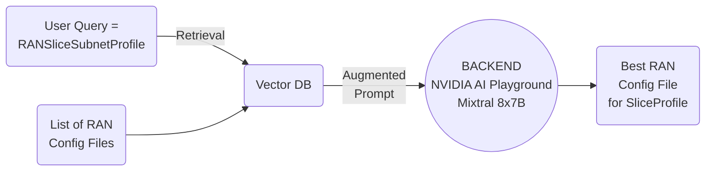

# 2025/01/20 Study Note (RAN Slicing's Thesis Problem Definition - RAN Slicing Related Topics 5)

###### tags: `2025`

**Goal:**
- [ ] Write research proposal for [LLM to Enable Vendor Specific Configuration File and RAN Slice SLA Parameter Generation for On-Demand RAN Slice Creation and Admission Control](#1-Research-Proposal-1-LLM-to-Enable-Vendor-Specific-Configuration-File-and-RAN-Slice-SLA-Parameter-Generation-for-On-Demand-RAN-Slice-Creation-and-Admission-Control)

**References:**
- [Prof. Ray | Template for BMW Lab.](https://hackmd.io/@RayCheng/rJIuoWmB8)
- [Wilfrid's Thesis Problem Definition - RAN Slicing Architecture](https://github.com/bmw-ece-ntust/guideline-template/blob/wilfridAzariah/studyNotes/20240826%20Study%20Note%20(Wilfrid's%20Thesis%20Problem%20Definition%20-%20RAN%20Slicing%20Architecture).md)
- [RAN Slicing's Thesis Problem Definition - RAN Slicing Related Topics](https://github.com/bmw-ece-ntust/guideline-template/blob/wilfridAzariah/studyNotes/20240829%20Study%20Note%20(RAN%20Slicing's%20Thesis%20Problem%20Definition%20-%20RAN%20Slicing%20Related%20Topics).md)
- [RAN Slicing's Thesis Problem Definition - RAN Slicing Related Topics 2](https://github.com/bmw-ece-ntust/guideline-template/blob/wilfridAzariah/studyNotes/20241217%20Study%20Note%20(RAN%20Slicing's%20Thesis%20Problem%20Definition%20-%20RAN%20Slicing%20Related%20Topics%202).md)
- [RAN Slicing's Thesis Problem Definition - RAN Slicing Related Topics 3](https://github.com/bmw-ece-ntust/guideline-template/blob/wilfridAzariah/studyNotes/20250109%20Study%20Note%20(RAN%20Slicing's%20Thesis%20Problem%20Definition%20-%20RAN%20Slicing%20Related%20Topics%203).md)
- [RAN Slicing's Thesis Problem Definition - RAN Slicing Related Topics 4](https://github.com/bmw-ece-ntust/guideline-template/blob/wilfridAzariah/studyNotes/20250117%20Study%20Note%20(RAN%20Slicing's%20Thesis%20Problem%20Definition%20-%20RAN%20Slicing%20Related%20Topics%204).md)

**Table of Contents:**
- [2025/01/20 Study Note (RAN Slicing's Thesis Problem Definition - RAN Slicing Related Topics 5)](#2025-01-20-study-note--ran-slicing-s-thesis-problem-definition---ran-slicing-related-topics-5-)
          + [tags: `2025`](#tags---2025-)
  * [1. Research Proposal 1 (LLM to Enable Vendor Specific Configuration File and RAN Slice SLA Parameter Generation for On-Demand RAN Slice Creation and Admission Control)](#1-research-proposal-1--llm-to-enable-vendor-specific-configuration-file-and-ran-slice-sla-parameter-generation-for-on-demand-ran-slice-creation-and-admission-control-)
    + [1.1. Research Proposal](#11-research-proposal)
    + [1.2. System Model/Architecture](#12-system-model-architecture)
    + [1.3. Scenarios for Experiments](#13-scenarios-for-experiments)
  * [2. Appendix](#2-appendix)

<small><i><a href='http://ecotrust-canada.github.io/markdown-toc/'>Table of contents generated with markdown-toc</a></i></small>

## 1. Research Proposal 1 (LLM to Enable Vendor Specific Configuration File and RAN Slice SLA Parameter Generation for On-Demand RAN Slice Creation and Admission Control)

### 1.1. Research Proposal

References:
1. [Comprehensive Tutorial on the Organization of a Standards-Aligned Network Slice/Subnet Design Process and Opportunities for Its Automation](https://ieeexplore.ieee.org/abstract/document/10375939)
2. [A Survey on Large Language Models for Network Operations & Management: Applications, Techniques, and Opportunities](https://arxiv.org/html/2412.19823v1)
3. [Digital Twins for 5G Networks: A Modeling and Deployment Methodology](https://ieeexplore.ieee.org/document/10103508)
4. O-RAN.WG1.Use-Cases-Detailed-Specification

- **Contribution:**
    - D
- **Background:**
    - S
- **Intended Outcome:**
    - T
- **Application Design:**
    - R
- **Findings:**
    - For future study
- **Challenge:**
    - N

### 1.2. System Model/Architecture
References:
1. [Juniper RAN Intelligent Controller - Admission Control Use Case](https://www.youtube.com/watch?v=HD3kDIp0VZI)
2. Yueh Huan's Thesis Oral Exam PPT
3. [Multimodal RAG Assistant with NVIDIA NeMo](https://github.com/NVIDIA/GenerativeAIExamples/tree/main/community/multimodal_assistant)

- System architecture:

- RAN Config File Selector Architecture

### 1.3. Scenarios for Experiments

| Scenario   | Goal       | Figures | Expected Result |
| ---------- | ---------- | ------- | --------------- |
| Scenario 1 | Problem    |         |                 |
| Scenario 2 | Novelty    |         |                 |
| Scenario 3 | Price Paid |         |                 |

## 2. Appendix

### 2.1. RANSliceSubnetProfile to Config File Mapping

| RANSliceSubnetProfile | OAI gNB Config                         | Viavi RIC Test Config | Expected Result |
| --------------------- | -------------------------------------- | --------------------- | --------------- |
| coverageTAList        | tracking_area_code                     |                       |                 |
| ueMobilityLevel       |                                        |                       |                 |
| resourceSharingLevel  |                                        |                       |                 |
| maxNumberOfUes        |                                        |                       |                 |
| resourceSharingLevel  |                                        |                       |                 |
| activityFactor        |                                        |                       |                 |
| dLThptPerSliceSubnet  |                                        |                       |                 |
| dLThptPerUE           |                                        |                       |                 |
| uESpeed               |                                        |                       |                 |
| reliability           |                                        |                       |                 |
| nROperatingBands      | dl_frequencyBand ul_frequencyBand |                       |                 |
| dLLatency             |                                        |                       |                 |
| delayTolerance        |                                        |                       |                 |
| sliceSimultaneousUse  |                                        |                       |                 |
| dLMaxPktSize          |                                        |                       |                 |
| energyEfficiency      |                                        |                       |                 |
| termDensity           |                                        |                       |                 |
| survivalTime          |                                        |                       |                 |
| dLDeterministicComm   |                                        |                       |                 |
| positioning           |                                        |                       |                 |
| synchronicity         |                                        |                       |                 |